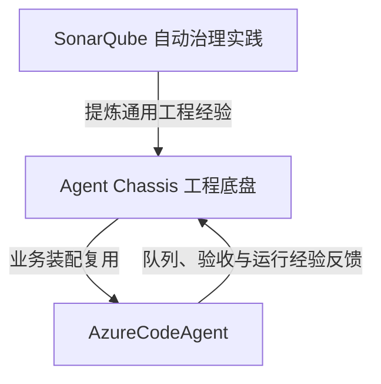
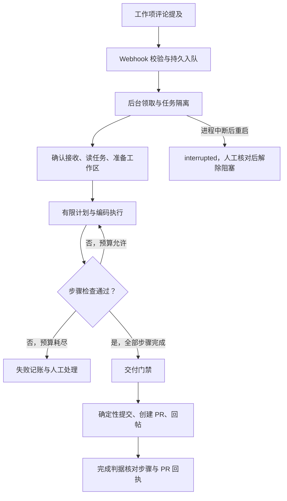

# DevOps 数字员工工程底盘 · 解决方案

**蒸馏真人员工的工作流，批量装配可验收的数字员工。**

| 项目 | 内容 |
|---|---|
| 作品 | DevOps 数字员工工程底盘（Agent Chassis） |
| 队长 | 董倪豪 / HSI-PSS-OIS |
| 成员 | 李建功 / HSI-PSS-OIS |
| 更新日期 | 2026-09-10 |
| 工程底盘 | [devops-agent-chassis](https://github.com/TIMPICKLE/devops-agent-chassis) |
| 底盘装配案例 | [AzureCodeAgent_Base_Agent_chassis](https://github.com/TIMPICKLE/AzureCodeAgent_Base_Agent_chassis) |
| 业务实践来源 | [SonarqubeAutoFlow_MAF](https://github.com/TIMPICKLE/SonarqubeAutoFlow_MAF) |

## 一、先看已经发生的业务价值

### 1. SonarQube 数字员工：处理重复的代码治理工作

系统从 SonarQube 获取待处理异味，由 MAF Agent 组织修复，调用 Claude Code CLI 修改代码，随后创建 Azure DevOps PR、记录结果并通知负责人。它把原本跨系统的人工操作串成可重复执行的流程。

团队提供的 2026-08-28 业务统计：覆盖 HSI、Portals、DSA 三个 BU，共 911 条处理记录，其中成功 637 条、失败 274 条，累计 SonarQube 预估修复工时 3667 分钟。业务数据在本次更新中沿用，具体口径见[成果报告](d-进阶加分交付物.md)。

该项目当前仍使用 Microsoft Agent Framework。它提供了底盘抽象所依据的业务经验与提效案例；不能把历史生产数据直接解释成当前底盘版本运行的统计。

### 2. AzureCodeAgent：在工作发生的地方调度 AI

开发者在 **Azure DevOps Work Item 评论**中 `@common.ois` 下达指令。系统接收任务、读取工作项、准备工作区、生成有限步骤计划，执行并验证代码，满足门禁后创建 PR 并回帖。无需切换到新的聊天应用。

维护者已确认该底盘装配版本实测可用。源码中的 `generated/azure_code.py` 直接接入 `agent_chassis`，组合 `NestedOrchestrator`、`PlanExecutePattern`、知识注入、失败策略、权限边界和观测能力。原业务的读取、编码、验证和 PR 服务保留在业务层。

2026-09-10 版本又增加了 SQLite 持久队列：接收与执行分离、同工作项按入队顺序串行、重复版本去重、运行状态查询、服务重启中断标记与人工处置。它解决了真实服务中的排队和恢复问题。这些能力当前属于 Azure 应用层，尚未全部成为底盘通用服务。

### 3. 三个仓库的关系

可展示的逻辑是“已有业务成果、实际复用案例、可复制的方法”。Azure 的规模化提效数据暂不与 SonarQube 合并计算。

## 二、需求背后的工程问题

单点 AI 工具能够减少重复操作，但每新建一个员工，都要重新处理同一批工程问题：任务如何进入系统、模型在哪里决策、规范何时传入、失败怎样收尾、结果由谁判断。

这些问题决定了一台数字员工能否长期工作。底盘把共同契约留在框架，把场景规则留在载荷，让第二个场景复用已经实现的能力。新业务依然需要接口适配、知识和验收规则；“约 200 行载荷”是轻量接线的表达，不能替代整个业务应用的成本说明。

## 三、产品定位：一套岗位执行与验收底盘

一台数字员工由四部分组成：

| 组成 | 负责什么 | 谁提供 |
|---|---|---|
| 工程底盘 | 通用编排、接入、知识时机、失败语义、观测合同 | 平台维护者 |
| 业务载荷 | TaskSource、DoneCriteria、领域工具及异常处理 | 业务团队与 AI 装配助手 |
| 执行能力 | 模型 API、Coding Agent、工具与外部系统 | 既有企业服务或适配器 |
| 岗位知识 | 规范、示例、例外与完成标准 | 真实岗位负责人 |

底盘核心包保持业务无关、无必需第三方依赖。运行真实员工时，仍需对应 MCP SDK、模型接入、Claude Code CLI、Web 服务依赖或编译器。

### 五大系统在 Azure 案例中的实际接线

| 系统 | 通用能力 | Azure 实际使用 |
|---|---|---|
| 编排 | 外层流程与内层推理分离 | Nested 外层五阶段，`agent_work` 接 Plan-and-Execute，执行失败有限重规划 |
| 接入 | ConnectorManager、MCP/REST/Mock、调用记录 | Azure DevOps MCP 在装配层挂载，业务服务调用工作项与 PR 接口 |
| 知识 | 显式注入时机、知识上下文和消费记录 | `BEFORE_EXECUTOR` 注入执行约束，`ON_RETRY` 反馈失败原因，`AGENT_BOOT` 留空 |
| 失败 | Ledger、失败策略、补偿钩子 | 成败记账，业务失败收尾；队列对中断状态额外要求人工核对 |
| 可观测 | RecordingObserver、EvidenceObserver | 每任务观察记录和结构化证据，结合队列状态查询 |

底盘适配层另支持 OpenAI/Anthropic SSE 完整重组、ReAct 独立工具并行、装配参数一致性检查和 HTTP 错误诊断。并行需要显式安全声明，默认单调用；这些是可选底盘能力，不代表 Azure 当前业务执行路径已经使用全部能力。

## 四、Azure 员工如何完成一项工作

队列返回 `accepted` 表示任务已持久接收。`succeeded` 表示该员工的判据通过，不能自动解释成 PR 已经被人工合入。

`CodeDoneCriteria` 检查步骤是否完成、步骤 ID 是否有验证记录、最新验证是否成功，以及启用交付时是否取得 PR id/url。它不读模型的完成声明。当前 PR 证据来自交付服务返回值，并非独立读取远端确认合入。

验证服务包含 Git diff 检查、适用文件类型的语法检查、敏感字符串扫描、**可配置**项目测试和辅助 LLM Code Review。未配置 `PROJECT_TEST_COMMAND` 时，项目测试会跳过；因此完整业务正确性仍需项目测试与人工审查支持。

## 五、“工作流蒸馏”具体蒸馏什么

真人员工知道如何处理正常任务，也知道哪些动作不能做、什么情况需要求助。这些经验需要被显式表达。

| 真人岗位经验 | 工程化表达 | 可检查的产物 |
|---|---|---|
| 从哪里接活，如何判断属于自己 | 任务源、准入条件、去重键 | 输入合同、事件样本 |
| 先看什么，何时修改，何时停下 | 编排节点、模型下放点、预算 | 装配清单和流程代码 |
| 遵循什么规范 | 有来源和版本的知识，按时机提供 | 知识文件、注入及消费回执 |
| 哪些动作必须受控 | 工具权限、运行环境、交付门禁 | 权限配置和拒绝记录 |
| 什么算真正完成 | 编译、测试、业务状态及交付回执 | DoneCriteria 和验收报告 |
| 失败或中断怎么办 | 重试上限、补偿、人工处置流程 | 失败记录、处置说明 |

当前做法是业务人员提供经验和边界，由 AI 辅助生成或接线，程序独立验收。这是**工作流资产化**。它与模型权重蒸馏不同；当前没有自动录制真人操作并自主学习任意岗位的能力。

## 六、批量装配的工程路径

### 以 AzureCodeAgent 为实际装配案例

AzureCodeAgent 展示了如何将一套真实业务流程接到底盘：工作项评论成为任务源，任务理解、计划与编码保留为业务能力，步骤验证与 PR 回执成为完成判据，通用编排、接入、知识注入、失败处理与观测通过装配脚本组合。

这个案例的复用价值在于：后续岗位可以沿用底盘契约，将工程投入集中到新业务的任务入口、领域工具、岗位知识和验收标准上。

### 将实际装配经验沉淀为岗位包

| 装配环节 | 团队提供什么 | 形成什么产物 |
|---|---|---|
| 明确岗位 | 工作来源、责任范围、正常步骤与例外 | 岗位说明和任务输入合同 |
| 接入能力 | 现有业务接口、模型服务、工具及权限 | 业务载荷与适配配置 |
| 配置运行 | 流程节点、知识时机、预算和失败处置 | 装配脚本与知识文件 |
| 验收交付 | 项目测试、业务完成标准和交付回执 | 验收器、运行记录和交付说明 |
| 复制推广 | 已验证的共用部分与新团队差异 | 可维护的岗位包及接入指南 |

Azure 已完成实际业务装配。统一岗位包格式、批次装配入口与跨团队管理是下一步产品化方向。推广时以新增岗位的接入和维护成本衡量复用价值。

### 底盘工程验收

[运行 34245972616](https://github.com/TIMPICKLE/devops-agent-chassis/actions/runs/34245972616)对应底盘 `68264ed` 的分层回归与兼容性检查。它用于支撑底盘工程合同；Azure 的实际业务可用性由其装配实现、维护者实测反馈及具体任务交付材料说明。

## 七、工程可信度与边界

| 议题 | 当前机制 | 必须明确的范围 |
|---|---|---|
| 模型自述成功 | 判据检查结构化事实和检查记录 | `facts` 是工程约定，可信度还取决于采集器与检查器 |
| 交付权限 | 模型执行器文件工具白名单，业务代码持有提交/PR 能力 | PermissionBoundary 不是操作系统沙箱；部署仍需限定目录、凭据和进程权限 |
| 失败收尾 | 策略调用已注册补偿并记账 | 不能自动撤销所有远端副作用；Azure 失败回调主要回复和记录 |
| 中断恢复 | Azure SQLite 队列持久接收，重启标记中断 | 单服务进程持有数据库，不是分布式调度或任意步骤断点续跑 |
| 知识升级 | 预览影响、检测冲突、保留定制、新版本重验 | 目前只更新已有知识内容，流程和工具代码变更尚需工程处理 |
| 证据完整性 | 内容 ID、版本、运行记录和验收回执 | 格式核验不构成生产认证或防篡改签名；Azure 模型用量采集仍需补强 |
| 版本定位 | Azure 声明基线 `68264ed` 并使用 `CHASSIS_ROOT` | bootstrap 记录版本字符串，不自动验证实际 checkout SHA，部署要自行核对 |

## 八、收益与推广

业务收益沿用 SonarQube 的 3 BU 历史实践和团队原测算。Azure 的价值首先体现在现有工作界面内完成任务，以及真实业务对底盘的复用。当前不把两个系统的处理量相加，也不把测试通过数换算为节省工时。

下一轮推广围绕**第二个团队的新增岗位**做对照：记录接入人时、修改的载荷/适配代码、验收采纳率、人工审查与返工时间、模型及运行成本。以这些指标证明“批量装配”的增量价值。

推荐推广顺序：已有场景标准化交付；第二团队复制并测量成本；补齐可迁移岗位包；形成组织级目录与治理。跨部门扩展以接口可达、验收可定义、异常可移交为前提。

## 九、比赛表达与未来承诺

开场用一条 Azure 工作项到 PR 的实际链路建立直观感受，再用 SonarQube 展示业务规模。随后揭示共同流程，引出底盘，通过 Azure 的实际装配脚本说明业务能力如何接入五大系统，再介绍将岗位经验标准化、复制到更多团队的路径。

**核心表达：我们将真人员工的处理步骤、规范、权限与验收标准沉淀为岗位资产，让组织可以复用这些经验装配更多数字员工。**

未来愿景是建立可版本化的数字岗位库：每个岗位带知识、工具、验收和运行说明，团队按实际流程装配，按证据决定上线。近期先补岗位模板、业务验收和接入成本测量，随后再建设批量装配与统一运营能力。自动行为学习、跨部门无人介入装配、分布式员工群治理属于后续研究与产品化方向。

完整上台安排与追问回答见 [比赛演示与答辩](f-比赛演示与答辩.md)。
