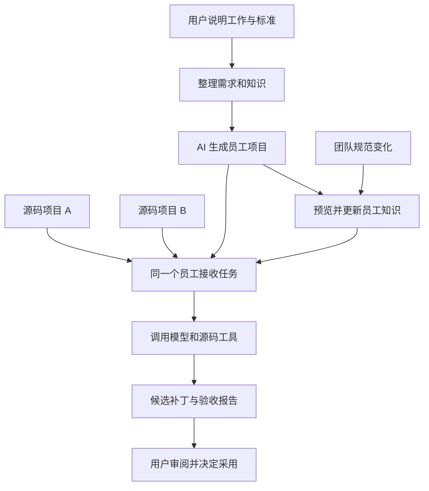
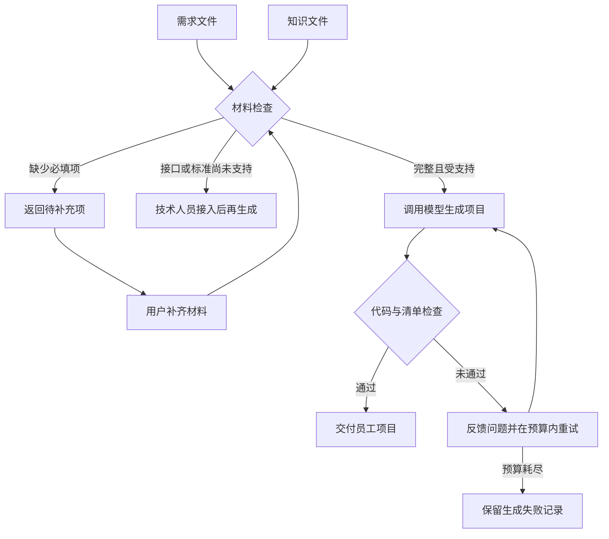
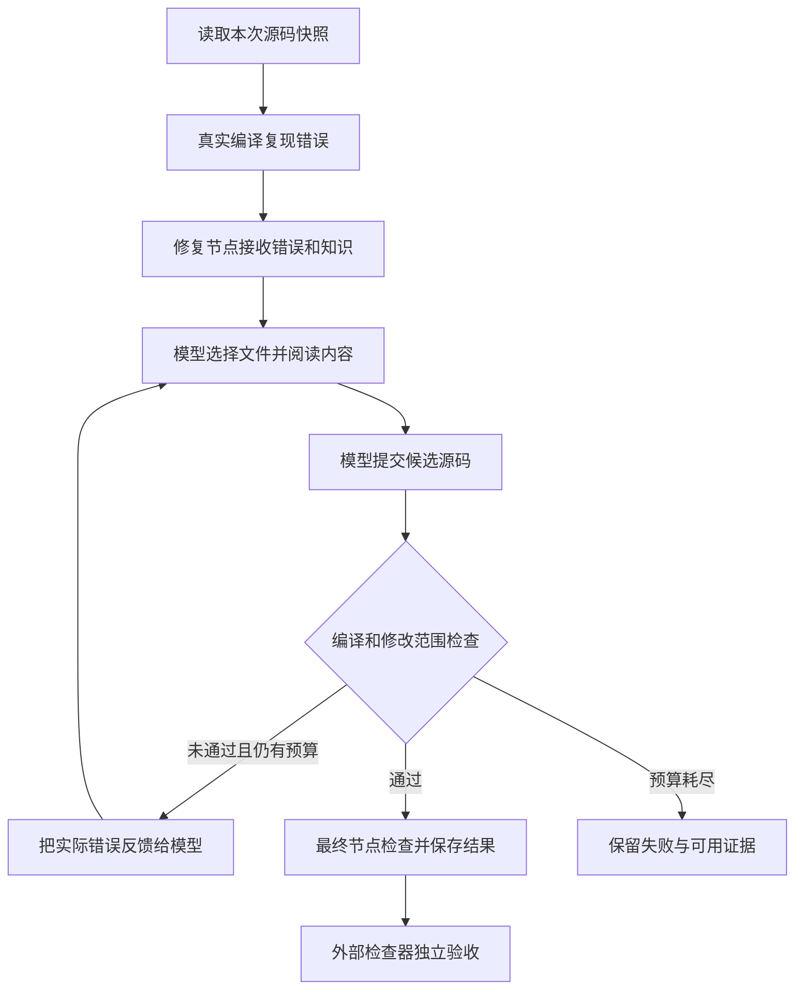
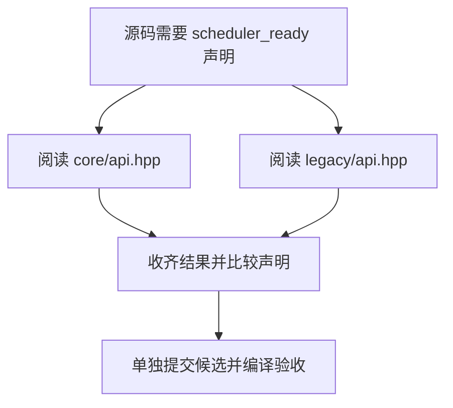
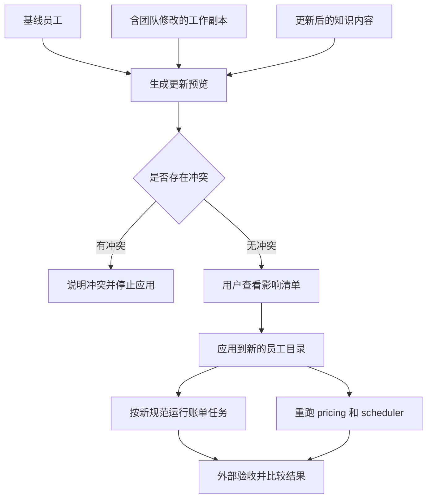

# 图解使用全过程：从一个需求，到可反复使用的 AI 数字员工

**用户说明工作和判断标准，AI 生成员工项目；这个项目接收真实任务，调用模型和工具处理，交付候选结果与验收报告。规范变化后，还能保留团队定制并更新知识。**

本文用一个已经跑通的场景，回答三个问题：**用户每一步怎么参与？每一步拿到什么？最后的项目怎样帮助用户完成工作？** 先看总览，再沿七步展开。

> 阅读约定：下文对话是使用示例，不是某次模型运行的逐字记录。当前入口是命令行，用户可以借助 AI 编程助手整理需求、调用命令和阅读结果；仓库尚未提供独立聊天界面。图中的生成、运行、更新程序均对应现有代码。

## 先看全貌：搭建一次，接着交给它不同任务

假设我是研发团队负责人。团队经常遇到一类小问题：C++ 代码找不到正确的头文件，编译卡住。每次都需要工程师找文件、核对声明、修改引用，再编译确认。

我想把这类重复工作交给一个可维护的数字员工，工程师负责提供规范、检查结果和决定是否采用。



这里有两种交付：**搭建时得到“能做这类工作的员工项目”，执行时得到“某一次任务的修复结果”。** 后续换一个源码目录，可以继续使用同一个员工。

| 用户走到哪一步 | 此时拿到什么 | 能据此做什么决定 |
|---|---|---|
| 1–2：说清工作、补齐材料 | 需求文件、知识文档、完成标准 | 确认员工的工作范围 |
| 3：生成员工 | 员工代码、流程清单、运行说明 | 检查是否按要求搭建 |
| 4–5：交任务、看验收 | 候选源码、差异补丁、检查报告 | 判断本次结果是否可以采用 |
| 6：换一个任务 | 同一员工的另一份独立结果 | 判断是否具有复用价值 |
| 7：修改规范 | 更新预览、新员工版本、新旧任务报告 | 判断新规则生效且原有任务仍可完成 |

## 第一步：我先说出具体需求

**用户对 AI 编程助手说：**

> “我们经常因为头文件路径写错而编译失败。帮我搭建一个员工：给它本地源码目录和出错的 C++ 文件，它找出正确头文件并给出补丁。只能改头文件引用，不要顺手改业务逻辑。最后告诉我有没有通过检查。”

助手按照仓库的装配指引，把这句话整理成三个可执行约定，交给用户确认：

| 需要说清楚的问题 | 本例的约定 |
|---|---|
| 它从哪里接任务？ | 用户指定本地源码目录和一个 C++ 文件；真正运行时再提供目录 |
| 它可以做什么？ | 阅读源码和头文件，修改目标文件中的 `#include` 引用，输出候选补丁 |
| 怎样才算完成？ | 原文件确实编译失败；候选通过规定的编译检查；非 include 代码保持不变 |

**本步产出：明确的工作范围。** 用户此时确认的是“做什么、怎样算做完”。

当前生成入口已经实现的任务类型，就是上述 C++ include 修复。若需求换成“处理采购审批”或“自动发布服务”，技术人员仍需接入对应任务来源、工具和验收代码。自然语言描述本身不会自动补齐这些业务接口。

## 第二步：我交给它知识，并确认验收规则

**用户接着说：**

> “这是团队的头文件引用规范。遇到同名文件要核对声明，不能只看文件名。修复时参考它；完成后必须重新编译。”

助手帮助整理成一个需求目录，生成程序实际读取其中的文件：

| 用户材料 | 落地文件或配置 | 程序如何使用 |
|---|---|---|
| 员工名称和工作说明 | `request.json` 中的名称与 `brief` | 告诉生成模型要装配什么员工 |
| 任务输入约定 | `task_interface: local_cpp_translation_unit` | 选择已经实现的本地 C++ 源码接口 |
| 完成标准 | `done_criteria: compiler_and_include_only` | 选择已经实现的编译与修改范围检查 |
| 团队规范 | `knowledge/include_rules.md`，并在需求中列出 | 生成时用于理解要求；运行修复节点时提供给模型 |

仓库已有可直接查看的[示例需求和知识](../employee_requests/build_repair)。用户与助手可以据此准备自己的材料。



**本步产出：需求文件 + 知识文件。** 缺少必填项时，命令返回 `needs_input` 和补充项，不调用模型；这目前是字段级检查，补问的自然语言表达由助手协助完成。

知识放在哪个阶段也有明确约定：本例绑定到**修复节点执行前**。项目清单记录这项绑定，运行报告记录实际消费的知识版本。它不会自行理解并执行任意公司制度；新增业务规则还需要对应的验收代码。

## 第三步：我要求生成，拿到一个可以查看的员工项目

**用户说：**

> “范围和材料确认好了，生成项目。让我看看它准备按什么步骤工作。”

助手或技术人员运行生成命令。模型根据需求、知识和底盘接口说明，编写员工的装配代码与清单。**这个阶段尚未拿到后面要修复的源码项目。**

生成成功后，用户得到一个项目目录：

| 产物 | 用普通话解释 |
|---|---|
| `employee.py` | 员工的执行入口：把任务、流程节点、模型工具和验收接起来 |
| `assembly.json` | 工作步骤清单：每个节点负责什么、知识何时使用 |
| `README.md` | 这个员工怎样启动、怎样接收任务 |
| `knowledge/` | 本次员工使用的规范副本 |
| `request.snapshot.json`、`project.json` | 员工是按什么需求、哪些文件和版本搭建的 |
| `generation.manifest.json`、`generation.evidence.json` | 生成时的模型调用与结果记录 |

**它确实会生成节点。** 当前生成入口允许 3–8 个线性节点，必须包含准备节点、一个模型节点和最终检查节点。下面按职责解释，实际节点名称和细分以生成清单为准：

| 节点职责 | 做什么 | 逻辑从哪里来 |
|---|---|---|
| 准备 | 接收任务，确认已有编译错误，准备修复阶段 | 模型生成节点接线；现有运行服务负责读取与编译 |
| 模型修复 | 结合错误和规范，决定读哪些文件、怎样改引用 | 模型生成调用接线；运行时模型根据本次源码作出具体选择 |
| 最终检查 | 检查候选是否编译通过、是否只改了允许部分 | 模型接入现有检查服务；通过条件由确定性代码执行 |

**本步产出：可运行的员工项目。** 用户检查步骤是否合理、规范是否绑定正确，然后给它第一个任务。生成成功只代表项目交付，能否完成工作仍需下一步实际运行证明。

## 第四步：我交给它一个真实任务，看它怎样处理

**用户说：**

> “先处理 pricing 项目的 `src/main.cpp`。修好后把补丁给我。”

助手或技术人员指定“员工项目目录、源码目录、目标文件、结果目录”启动运行。以仓库的 pricing 案例为例：目标文件引用了找不到的 `tax.hpp`，实际可用的头文件在 `include/pricing/tax.hpp`。



模型使用源码工具读取真实文件，可以比较多个候选头文件，再提交修改。底盘把真实编译结果反馈给它，因此一次错误候选有机会在预算内继续修正。协议异常等执行错误也会记录为失败，并不保证都能自动恢复。

本例期望的补丁很小，用户能直接审阅：

```diff
-#include "tax.hpp"
+#include "include/pricing/tax.hpp"
```

这是该案例目标修复的示意，实际交付以每次运行的补丁为准。原来的函数和业务计算保持不变，原始源码目录也保持不变。

**本步产出：候选源码、候选补丁和运行记录。** 文件留在指定结果目录，下一步用客观检查判断本次任务是否成功。

## 第五步：我看报告，决定是否采用

**用户说：**

> “不要只告诉我‘修好了’。给我看改了什么、哪些检查通过了；失败也要说明。”

运行命令会调用位于生成代码之外的检查器，重新编译原始输入和候选，并核对补丁、节点执行及知识使用记录。技术人员还可以单独调用检查器，复查已保存的结果并汇总多个任务；这个过程不需要再次调用模型。

| 用户关心什么 | 查看哪个产物 | 可以确认什么 |
|---|---|---|
| 到底改了哪里？ | `candidate.patch`、`candidate.cpp` | 修改差异及完整候选源码 |
| 原来真的有问题吗？ | `baseline.compiler.json`、`workspace.snapshot.json` | 原始编译错误与当时的源码输入 |
| 本次任务过关了吗？ | `acceptance.json` | 编译和修改范围的验收结果 |
| 真正执行过哪些动作？ | `runtime.manifest.json`、`runtime.evidence.json` | 运行过程、知识消费和模型调用记录 |
| 多个任务整体怎样？ | 外部检查器输出的 `summary.json`、`summary.md` | 各任务的独立验收汇总 |
| 如果失败了呢？ | `failure.json` 及已保存的证据 | 失败原因和已完成的处理；部分文件可能尚未产生 |

现场可以先打开补丁，再打开 `acceptance.json`，最后按需展开运行记录。下面是 pricing **成功结果的阅读示意，并非新增实测报告或程序自带界面**：

| 展示给用户的结论 | 对照实际文件的方法 |
|---|---|
| 引用从 `tax.hpp` 改为 `include/pricing/tax.hpp` | 在 `candidate.patch` 中查看具体差异 |
| 原文件编译失败，候选通过检查 | 原始编译报告退出码非零；`acceptance.json` 中 `accepted=true`、`compiler_exit=0` |
| 修改范围符合“只改 include”的约定 | 外部检查器重新检查候选与补丁；不能仅凭编译通过推断这一点 |
| 原始源码目录保持不变 | 运行命令生成的 `acceptance.json` 中 `original_unchanged=true` |
| 本次是否实际并行读取？ | 查看运行记录中的批次峰值；大于 1 才表示工具调用曾同时处于执行中 |

演示时应展示本次文件里的实际结果。失败时改看 `failure.json` 和已保存的证据；没有产生的检查结果不能填成“通过”。归档后单独核验若未提供原始目录，不能重新证明该目录未变。

底盘会提前检查配置冲突，并帮助区分“工具调用不符合约定”和“模型服务请求失败”。独立读取可以并行，实际发生了多少并发会留下记录；配置了 4 个并发并不代表任务一定更快。
如需进一步核对代码来源、装配配置和各项检查记录，技术人员可接入[生产格式证据检查](PRODUCTION_EVIDENCE.md)。具体任务是否完成，仍由编译及业务检查决定。

**本步产出：可审阅的补丁 + 可以复查的成功或失败结论。** 工程师据此决定是否把补丁应用到开发流程。当前链路交付本地候选，不自动创建业务 PR 或部署。

本例“通过”的准确含义是：原始文件失败，候选通过 **C++17 单编译单元语法与头文件检查**，且非 include 代码未变。它不等同于完整项目构建、链接、业务测试全部通过；这些需要项目自己的验收接入。

## 第六步：我换一个项目，继续用同一位员工

**用户说：**

> “再处理 scheduler 项目的 `app/worker.cpp`。这次有两个同名头文件，别选错。”

用户保持员工项目不变，只换源码目录、目标文件和结果目录。任务在新进程中启动，模型读取新的编译错误和文件内容，选择具有正确声明的头文件，再经过同样的验收。

这一例也适合展示并行读取。技术人员在运行命令中开启并行后，模型可以把两个独立的头文件读取放进同一批次：



`include/core/api.hpp` 提供 `scheduler_ready()`；同名的旧头文件提供的是 `legacy_worker_ready()`。用户可看到它依据文件内容选择正确引用，而不仅是匹配文件名。上图是**允许的并行执行方式**，具体动作以本次运行记录为准；模型也可能选择逐个读取，或用一次 `read_files` 读取多个文件。

并行只用于已声明安全的独立工具，提交候选仍单独执行。现场若要稳定展示“确实同时执行过”，可先运行[技术版中的离线并行演示](TECHNICAL_USE_CASE.md#parallel-demo)，再查看真实员工的批次记录；离线演示不代表真实模型必然选择并行，也不提供企业任务加速比。

**本步产出：第二个任务自己的补丁和报告。** 第一次生成的 `employee.py` 被复用，没有为了第二个项目重新生成员工。

这说明员工项目可以承接同一类工作中的不同输入。目前已经用 pricing、scheduler 两个小型公开项目验证；复杂企业仓库的适用性还需要进一步验证。

## 第七步：规范变了，我要求保留定制并更新员工

用一条更容易观察规范作用的任务来演示维护：账单代码可以引用 v1 或 v2 头文件，两者都能编译，但团队现在要求使用 v2。此前团队还给员工代码加了启动日志，并新增了值班说明。

**用户说：**

> “账单规范改成 v2。先告诉我会影响哪里；我们加的日志和说明要保留。更新后，既要按新规范做事，也要继续能处理原来的两个项目。”

技术人员提供三份材料：未修改的基线员工、团队维护的工作副本、更新后的知识目录。需求字段和知识文件列表保持不变，这次只修改既有知识文件的内容。



| 用户参与 | 工程底盘返回 | 用户能看懂的结果 |
|---|---|---|
| “先预览” | `plan.json`、`plan.md` | 哪份知识变了、哪些节点受影响、哪些人工文件会保留、有无冲突 |
| “按这份计划应用” | 新项目目录、`revision.json`、`update.md` | 生成新版本，代码与团队说明从工作副本原样保留；保留基线版本记录 |
| “用新规范处理同一个账单输入” | 新旧员工的两份运行报告 | 旧版选 v1，新版选 v2，选择随知识变化 |
| “再检查旧任务” | pricing、scheduler 的回归报告 | 更新后的员工仍能完成原有任务 |

预览和应用知识更新的过程不调用模型；随后运行任务仍调用模型。工具不自动重写团队代码，也不自动解决任意流程变更。出现知识冲突、需求字段变化等情况，会说明问题并阻止应用。

这里还有一个关键点：**“能编译”不足以证明“遵守 v2 规范”。** 这个演示另有业务检查器，专门检查实际选择的头文件版本；该规则已经写在验收代码中。新业务也需要匹配的检查，不能仅靠模型声称遵守规范。

**本步产出：保留团队定制的新员工版本 + 新旧任务的验证结果。** 更新成功只表示新版本创建完成，具体任务是否通过由运行报告证明。

## 最后，我真正获得了什么价值？

一次搭建沉淀了可以继续使用和修改的员工项目；每次工作都有输入、候选结果和检查记录。用户可以选定员工、交付任务、审阅结果，减少重复解释需求和手工拼接工具、检查的工作。

| 已经具备的能力 | 对使用者的实际意义 |
|---|---|
| 根据需求生成可查看的装配代码和流程 | 技术人员能审阅和接手维护，知道员工怎样工作 |
| 同一员工处理不同源码输入 | 可以在同类任务中复用，不必每次重建项目 |
| 规范在修复阶段被使用，并记录版本 | 结果可以追溯到当时的要求，便于解释行为变化 |
| 模型提出候选，外部代码验收 | 把“模型说完成了”落实成可以复查的检查结果 |
| 知识更新保留人工修改，并重验任务 | 员工可以随团队规则演进，已有定制能继续保留 |

这些是本项目参赛可展示的产品能力。是否节省了多少工时、能否适配企业完整构建，还需要真实业务试用数据，本文不把小案例结果换算成生产收益。

## 评委如何核对：已有两条真实验证链路

| 可核对的过程 | 实际结果与说明 | 证据 |
|---|---|---|
| 生成 → 两个源码任务 → 独立验收 | 真实模型生成一次，同一员工完成 pricing、scheduler；生成 1 次调用，运行分别 3、2 次，共 6 次 | [第四阶段 Actions](https://github.com/TIMPICKLE/devops-agent-chassis/actions/runs/34020348896) · [项目与报告归档](https://github.com/TIMPICKLE/devops-agent-chassis/actions/runs/34020348896/artifacts/9985301316) · [实测说明](../changelog/stage-04.md) |
| 定制 → 更新知识 → 新旧任务验收 | CI 模拟团队添加日志与说明；同一账单输入从 v1 选择变为 v2，两个旧任务继续通过；生成及运行共 9 次调用，更新 0 次 | [第五阶段 Actions](https://github.com/TIMPICKLE/devops-agent-chassis/actions/runs/34033606604) · [项目与报告归档](https://github.com/TIMPICKLE/devops-agent-chassis/actions/runs/34033606604/artifacts/9989457780) · [实测说明](../changelog/stage-05.md) |

Actions 页面可查看作业结果与日志，归档可查看完整项目和报告；归档保留期为 14 天，超过保留期后可能无法下载。两次运行验证的是各自记录的代码版本与公开案例，不代表任意需求都能成功。最新能力与受测版本见[当前状态索引](../roadmap/CURRENT_STATE.md)。

配置检查、并行记录和失败诊断等后续维护通过合同与离线回归验证，记录见[维护索引](../changelog/docs-sync-t01-t05.md)。这些验证没有新增企业实机或付费模型实测，不替代上表两次历史实测。

生成的项目目前需要兼容的本仓库代码和参考模块才能运行，尚未独立打包交付。下一步重点是接入真实构建命令、项目专属验收和更贴近业务的任务输入，路线见 [Roadmap](../roadmap/README.md)。

## 想亲手操作或继续了解

- [完整生成与运行命令](GENERATED_EMPLOYEE_PROJECT.md)：准备需求、生成员工、运行两个源码任务、独立验收。
- [完整更新命令](EMPLOYEE_PROJECT_UPDATES.md)：准备基线与工作副本、预览、应用、验证新旧任务。
- [技术评委版](TECHNICAL_USE_CASE.md)：节点逻辑怎么生成、知识如何路由、底盘如何组织执行及源码位置。
- [阶段变更概览](../changelog/README.md) · [返回首页](../README.md)。
