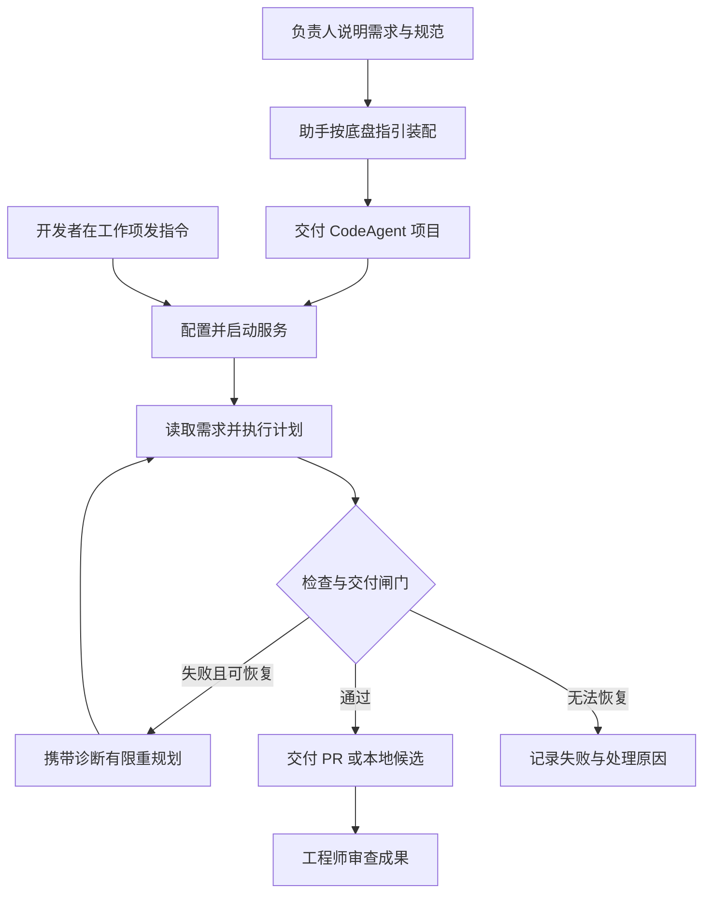
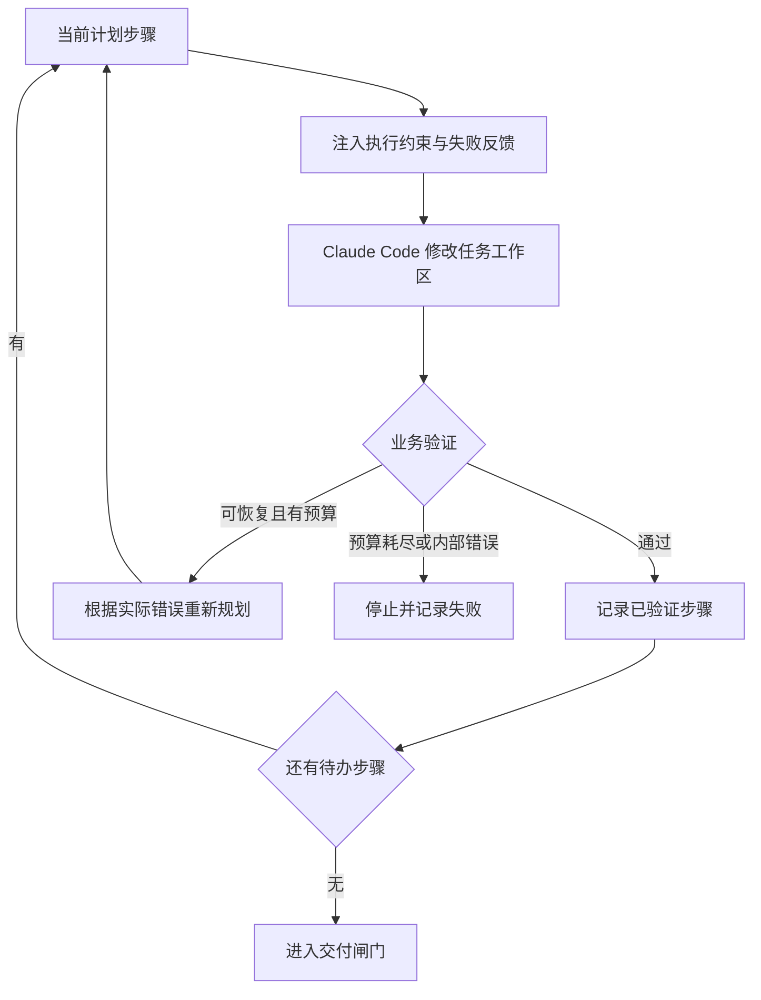

# 全流程演示：通过工程底盘，装配一位 Azure DevOps CodeAgent

已有岗位现在可以通过[岗位配方库](ROLE_RECIPES.md)复用到新项目：选择 Azure CodeAgent 或 SonarQube 配方，填写项目配置，创建独立员工实例，再准备运行环境并验收。本页继续说明 CodeAgent 的业务交互；配方库提供可操作的复用入口。

**研发负责人说清工作方式，AI 助手按工程底盘规范装配出 CodeAgent；开发者随后在 Azure DevOps 工作项里 `@common.ois`，由这个员工读需求、规划、改代码、检查并交付 PR。**

本文以已经完成装配的 [AzureCodeAgent_Base_Agent_chassis][codeagent] 为主角，展示两次不同的交付：**装配时交付一个可持续运行的员工项目，使用时交付一项具体工作的代码成果。**

> 阅读说明：下文对话依据实际装配设计和代码还原，便于现场演示，并非历史聊天逐字记录。“工程底盘助手”指加载底盘装配指引的 AI 编程助手；当前没有单独的底盘聊天产品。后半段的健康检查需求是说明运行过程的示例任务，不冒充某次企业工单的实测记录。源码依据为 CodeAgent `a92270a`，其装配报告记录使用底盘 `68264ed`。

## 两分钟先看：用户说什么，最后得到什么

| 阶段 | 用户的交互 | 得到的成果 |
|---|---|---|
| 1. 提需求 | “把我们处理工作项、改代码、提 PR 的流程做成数字员工。” | 工作范围、输入来源和交付标准 |
| 2. 定流程 | “先读完整需求再规划，允许有限纠错，交付必须过检查。” | 五阶段流程及规划、验证、重规划规则 |
| 3. 给规范与接口 | “沿用现有模型、Claude Code 和 Azure DevOps 接口，按目标仓库规范工作。” | 知识注入、接口配置、权限与失败处理约定 |
| 4. 装配项目 | “按这个方案搭起来，让我看到代码和装配结果。” | **完整 CodeAgent 项目、装配报告、测试与使用说明** |
| 5. 接入工作环境 | “让它接收工作项评论，先试运行，再开启 PR 交付。” | 可接收任务的服务及明确的交付模式 |
| 6. 下发具体任务 | 在工作项评论区 `@common.ois` 并说明编码需求 | 任务状态、结构化需求、独立工作区、执行计划 |
| 7. 看它执行和检查 | “按工作项验收要求修改，不通过就根据错误修正。” | 代码变更、逐步验证结果与失败记录 |
| 8. 收成果并复用 | 打开返回的 PR，审查；下次再发另一项任务 | **可审查 PR 或本地候选；同一员工继续接任务** |

## 第一幕：把实际工作流程装配成一个员工

### 第一步：用户描述的，是一个岗位的工作

**用户：**

> 我们已经有一套 CodeAgent 业务：开发者在 Azure DevOps 的工作项评论里 @common.ois，要求改代码。它需要读取完整需求，准备仓库，规划并调用 Claude Code 编码，检查后创建 PR，再把链接回复到工作项。请基于工程底盘重新装配，保留已有业务能力。

**工程底盘助手：**

> 我先阅读原项目，把已有能力和需要统一管理的流程找出来。任务来源是工作项评论；编码由现有执行器承担；完成标准要包含实际验证和交付结果。已有的模型客户端、MCP 接口与业务代码可以继续用。

**用户：**

> 对。以后还要处理不同类型的开发任务，不能把整个员工限定成某一种语言或某一种错误修复。

助手将需求整理成三个约定：

| 约定 | CodeAgent 的实际落点 |
|---|---|
| 从哪里接任务 | Azure DevOps 工作项事件，识别 `@common.ois` 后的指令；按工作项和版本识别任务 |
| 能做哪些工作 | 读取工作项及验收条件，在配置的目标仓库中执行具体编码任务，结合目标仓库规范工作 |
| 怎样才算完成 | 计划中的每一步都有验证记录；本地检查通过；若要求远端交付，还必须确认真实 PR 标识和链接 |

**本步产出：岗位需求和验收约定。** 这些内容在实际项目的[装配设计][design]中有记录，随后落为[任务源与完成判据][payload]。用户先确认工作范围，助手再决定怎样接线。

### 第二步：助手提出流程，用户确认哪些环节交给模型

**工程底盘助手：**

> 推荐五个外层阶段：确认收到、读取工作项、准备工作区、执行编码计划、检查并交付。前后流程由程序控制；在编码阶段让模型决定本次怎么改，并逐步调用执行器。验证失败可以重新规划。

**用户：**

> 可以。先规划再执行，最多五个计划步骤、两次失败重规划。普通地推进到下一步，不应该算一次失败重试。不要让模型自己决定跳过验证直接提 PR。

这是本项目实际采用的 `NestedOrchestrator + PlanExecutePattern` 组合，默认业务预算为 5 步、2 次重规划：

| 外层阶段 | 具体职责 | 逻辑来自哪里 |
|---|---|---|
| `acknowledge` | 向工作项回复已接收 | 业务评论接口，由固定流程调用 |
| `read_work_item` | 读取工作项；模型结合描述、验收条件和评论整理任务 | 业务读取器与模型客户端 |
| `prepare_workspace` | 准备独立任务目录和 Git 分支 | 业务工作区工具 |
| `agent_work` | 规划 → Claude Code 编码 → 本地验证 → 推进或重规划 | 底盘规划模式调用业务计划器、执行器和验证器 |
| `delivery_gate` | 检查全部步骤的验证事实，按模式交付并回复 | 业务交付器与底盘完成判据 |

“固定流程”表示程序决定阶段顺序；阶段内部仍可调用模型，例如读取阶段会生成任务摘要。**五个流程节点在装配时接好，每次任务的具体编码计划在运行时生成。**

**本步产出：用户认可的流程和纠错预算。** 对应实际的[装配脚本][assembly]；不需要用户先学会编排框架再选择类名。

### 第三步：把公司规范、现有工具和交付边界接进去

**用户：**

> 模型服务、Claude Code 和 Azure DevOps MCP 都沿用现有配置。技术栈规范放在目标项目里，执行时先读。Claude 只负责文件修改，提交、推送和 PR 创建由程序在验证后做。失败要留下原因，别无限重跑。

**工程底盘助手：**

> 我会把这些分别接到知识、接口、权限、失败处理和观察记录中。业务逻辑保留在员工项目，通用底盘继续复用。

| 用户给出的要求 | 装配动作 | 用户能看到什么 |
|---|---|---|
| 按目标项目规范编码 | 执行前注入 `knowledge/code-execution.md`，要求读取目标仓库已有的 `CLAUDE.md`、`AGENTS.md` 和相关 skills | 执行约束文件；装配报告中的 `BEFORE_EXECUTOR` 绑定 |
| 下一轮要知道上次为什么失败 | 配置 `RetryFeedback@ON_RETRY` | 失败诊断进入后续执行上下文 |
| 沿用现有外部能力 | 复用模型客户端和 Claude CLI，MCP 通过底盘连接器挂载 | 模型环境变量约定、MCP 配置、调用代码 |
| 编码器只改文件 | 组合底盘权限检查与 Claude CLI 文件工具白名单 | 执行器仅获读写能力；Git/PR 操作留在程序交付阶段 |
| 出错后能追踪、能停下 | 接入失败策略、持久账本和业务失败回调 | 任务终态、失败说明及已注册回调的处理结果 |
| 事后能解释发生了什么 | 挂载观察记录和结构化证据观察器 | 阶段记录、工具调用、知识注入与验证记录 |

**本步产出：一套明确的装配配置与业务知识。** 具体知识见[执行约束][knowledge]，接口与业务接线见[服务适配层][services]。`AGENT_BOOT` 保持空，目标项目的技术栈知识在执行阶段读取。

这里的边界有具体实现含义：权限对象还需要调用检查和执行器配置才能生效；失败策略只执行已经接上的处理，不保证自动撤销已发出的评论、已推送的分支或已创建的 PR。

### 第四步：装配完成，用户拿到一个实际项目

**用户：**

> 按刚才确认的方案装配。我要拿到能维护、能运行的项目，也要知道哪些测试已经做了。

**工程底盘助手：**

> 项目会包含任务源、完成判据、装配脚本和已有业务能力的适配，还会提供启动入口、配置说明与验证记录。你可以从装配报告检查它到底用了哪些底盘组件。

实际成果就是 [AzureCodeAgent_Base_Agent_chassis][codeagent]：

| 交付物 | 用户为什么需要它 |
|---|---|
| `docs/assembly-design.md` | 回看岗位需求、八组装配决策及理由 |
| `payloads/azure_code.py` | 定义接什么任务、怎样算完成，以及业务动作的适配 |
| `generated/azure_code.py` | 将五阶段、规划模式、知识、权限、失败与可观测组件装配起来 |
| `agents/`、`tools/`、`clients/` | 保留并适配读工单、工作区、模型规划、Claude 编码、验证和 PR 等真实业务能力 |
| `knowledge/code-execution.md` | 维护执行阶段的通用要求 |
| `cli.py`、`webhook_receiver.py`、配置模板 | 启动、接收任务和检查配置的入口 |
| `tests/`、`docs/FINAL_ASSEMBLY_REPORT.md` | 查看验证覆盖、历史结果与当时尚未执行的项目 |

**本步产出：完整的 CodeAgent 员工项目。** 原项目的 LangGraph 编排被底盘编排替代，已有业务能力被迁移和接入；这次装配不需要修改底盘核心。业务适配仍然包含真实代码，不只是填几项配置。

现场可打开项目，然后运行 `python cli.py assembly` 查看装配报告。报告会列出流程、推理模式、连接器、知识时机、权限和载荷；如果连接器发现失败，也会显示实际诊断，不能把“打印出报告”当作全部接口已连通。

[历史装配报告][report]记录了 **58 个测试通过**，并分别列出了当时未执行的真实模型、MCP 和端到端 PR 联调。该数字是那次装配的结果；项目后续已有任务队列等更新。演示真实交付时，应以部署环境当次任务的记录为准。

## 第二幕：开发者使用这个已经装配好的员工

### 第五步：部署一次，让它进入团队现有工作流程

**用户：**

> 让开发者直接在 Azure DevOps 里用。先在测试仓库验证，再开启 PR 交付。

**工程底盘助手：**

> 配置目标项目、仓库、分支、模型服务和 MCP 后，启动 Webhook 服务，并把工作项事件接到它。关闭交付时保留本地候选；开启交付后，验证通过的任务会进入提交、推送和 PR 创建流程。

这是一次部署准备。技术人员完成配置后，日常使用者只需要工作项评论入口。

| 现场操作 | 对应命令或配置 | 这一步实际确认什么 |
|---|---|---|
| 指向兼容的底盘代码 | 设置 `CHASSIS_ROOT`；历史装配版本见 `bootstrap.py` | CodeAgent 能定位底盘依赖 |
| 安装并配置环境 | `pip install -r requirements.txt`，按项目说明配置 `.env` 和 MCP | 模型、Azure DevOps、目标仓库和 Claude CLI 运行环境就绪 |
| 查看配置与装配 | `python cli.py status`、`python cli.py assembly` | 当前设置与组件清单；仍需实际接口联调 |
| 查看离线装配自检 | `python cli.py smoke` | 使用替身业务服务验证接线，须阅读具体输出 |
| 配置项目验收命令 | `PROJECT_TEST_COMMAND`，格式为 JSON 参数数组 | 把目标项目的实际测试接到验证阶段，例如 `["python", "-m", "pytest", "-q"]` |
| 选择交付方式 | `COMMENT_DELIVERY_ENABLED=false` 或 `true`，默认 `false` | 本地候选或远端 PR 两种完成范围 |
| 启动并连接工作项事件 | `python cli.py serve`；Service Hook 指向 `/webhook/ado-comment` | 服务可以接收 Azure DevOps 任务 |

`smoke` 可能输出跳过或异常提示，不能只看最后的“完成”；它也不会证明真实模型、Claude Code 和企业接口都已成功运行。关闭 PR 交付仅控制交付阶段，接收、读取等业务阶段仍可能调用外部接口。

**本步产出：部署好的 CodeAgent 服务。** 当前项目还提供持久任务队列和状态接口，重复投递、同工作项顺序与中断处理见[队列使用说明][queue-howto]。

### 第六步：开发者在工作项里下发编码任务

为了把交互讲具体，下面用一个**演示输入**贯穿后续步骤：目标 Python 服务需要增加健康检查接口。现场可换成自己的真实工作项，不需要换 CodeAgent 的装配流程。

**工作项描述与验收条件：**

> 为目标服务增加 `GET /health`，正常响应 HTTP 200 和 `{"status":"ok"}`。补充接口测试及使用说明，不修改已有业务接口的行为。

**开发者在评论区：**

> @common.ois 请按这个工作项的描述和验收条件实现，遵循仓库规范，补齐测试和文档，验证通过后提交 PR。

接下来，不再需要用户手工把需求复制给多个工具：

| 执行阶段 | 员工做什么 | 产出与查看位置 |
|---|---|---|
| 接收与排队 | 保存事件，识别工作项和版本，防止相同事件重复执行 | Webhook 返回 `task_id`、`status_url`；可通过任务接口查看状态 |
| 确认收到 | 开始业务处理后调用评论接口回复 | 工作项评论区的接收回复；接口异常时看日志 |
| 读取需求 | 读取完整工作项，结合描述、验收条件和本次指令整理任务 | 运行中的 `input_data` 与任务摘要 |
| 准备工作区 | 为本任务准备独立目录和分支 | `workspace_path`、`branch_name` |
| 生成执行计划 | 模型产生声明式编码步骤 | `plan_steps`、当前执行步骤及对应验收条件 |

对于上述输入，可以把计划解释为“实现接口并补充测试，再同步使用说明”；**具体拆分由当次模型输出决定，最多五步是默认预算，不是固定模板。**

队列返回“已接收”只说明任务已入队，尚未代表代码完成。当前实现的计划和中间细节主要在运行状态、终端及日志中查看，没有自动把每一步规划都回贴到工作项的交互界面。

**本步产出：一个有身份、有需求、有工作区、有计划的具体任务。** 任务接收后查询 `/tasks/{task_id}`，能够继续区分等待、运行、成功、失败等状态。

### 第七步：编码、验证、必要时纠错

**开发者的要求：**

> 不要只说“写完了”。按工作项要求做检查，失败后根据错误修正，最后让我看到改动和验证结果。

CodeAgent 在每个计划步骤里，先把执行约束和所需上下文交给 Claude Code，再调用业务验证器检查实际修改。

用户看验证结果时，要区分每类检查实际证明的内容：

| 检查 | 本项目如何使用 | 能证明什么 |
|---|---|---|
| 实际代码差异 | 收集变更文件并执行 `git diff --check` | 确实产生修改，并检查差异中的空白错误 |
| 语言及结构检查 | 按修改文件类型检查 Python 语法、JSON、括号配对等 | 对应范围的语法或结构检查；并非各语言完整构建 |
| 敏感字符串扫描 | 扫描变更文件中的常见凭据模式 | 是否命中已实现的扫描规则 |
| 项目测试 | 执行配置的 `PROJECT_TEST_COMMAND` | 这条命令覆盖的项目测试结果；未配置时会跳过 |
| LLM Code Review | 结合任务和 diff 做语义审查，输出通过、告警或失败 | 模型对需求一致性等问题的辅助判断 |

例如，演示需求的 `GET /health` 行为应由接口测试来验证。只通过括号检查、或 LLM 认为实现合理，都不足以证明 HTTP 响应满足要求。**完成判据读取程序记录的事实，LLM 审查仍是模型判断；两者不能混为“全都经过确定性证明”。**

验证失败会进入有限重规划，已完成且验证过的步骤可保留。正常推进不消耗失败重规划预算；预算耗尽或不可恢复错误会停止。当前队列也不会因进程重启而自动续跑中断任务，中断需要按操作指南核对。

**本步产出：真实文件改动、每步验证结果，以及成功推进或失败终止的依据。** 实现见[业务验证器][verification]和[载荷的执行—验证接线][payload]。

### 第八步：收取成果，确认这次到底完成了什么

**开发者：**

> 完成后把成果放回我们的工作流程，我来审查。

交付阶段首先检查全部计划步骤是否完成、每一步是否有验证记录、是否仍有错误。通过后，再按配置执行：

| 交付模式 | 员工交付什么 | 用户怎样验收 |
|---|---|---|
| 开启远端交付 | 程序提交并推送任务分支，经 MCP 创建 PR，确认非空 PR ID 和 URL，再尝试回复链接 | 打开真实 PR，检查代码差异、测试和说明，决定是否合并 |
| 关闭远端交付 | 保留任务工作区中的修改，在 `localJSON/candidates/` 写入候选记录 | 根据记录找到工作区、分支、计划与验证结果，审查本地候选 |
| 执行或交付失败 | 记录错误、任务状态，调用失败处理与回复逻辑 | 查看失败原因及远端已有结果，决定后续处理 |

对于示例任务，用户最终应能在 PR 中看到健康检查接口、对应测试及说明；工作项回复包含 PR 链接、分支与变更摘要。**这些是成功路径的预期成果，现场展示时使用实际生成的文件和链接。**

PR 的创建结果必须包含有效标识；推送或创建失败不能仅凭模型说“完成”判成功。PR 创建与最终评论回复也可能分别成功或失败，必要时直接检查 PR 和日志。CodeAgent 的自动交付到 PR 为止，合并仍由团队审查流程决定。

想进一步核对时，成果分布如下：

| 想看什么 | 当前 Webhook 路径中的位置 |
|---|---|
| 当前任务进展与最终结果 | `/tasks/{task_id}`；持久状态默认在 `localJSON/tasks.db` |
| 阶段与工具调用记录 | `localJSON/state/tasks/{task_id}/observer.json` |
| 本任务底盘去重账本 | 同目录下的 `ledger.json`；Webhook 总体去重由队列管理 |
| 本地候选信息 | `localJSON/candidates/candidate_*.json`，其中包含工作区路径与验证结果 |
| 业务运行细节 | `logs/YYYY-MM-DD/agent.log` |
| 结构化底盘证据 | `EvidenceObserver` 已挂载，当前保存在实例内存；需要由调用方显式导出，不能假设已有逐任务 evidence 文件落盘 |

CLI 直接运行和 Webhook 的状态目录不同，上表以部署服务的 Webhook 路径为准。证据字段是否完整也取决于业务接线，例如当前服务适配层未补齐模型调用元数据采集，不能仅因存在观察器就宣称每次 LLM 调用都有完整证据。

**本步产出：可审查的 PR 或本地候选，以及与本次任务对应的过程记录。** 用户的下一步是审查成果，不需要自己重新串起读工单、找仓库、运行编码器和创建 PR 的步骤。

## 同一位员工继续工作，工程底盘继续复用

**用户：**

> 下一次是修改另一个接口，或者补一项配置功能，还需要重新搭一遍吗？

**工程底盘助手：**

> 在已经配置的目标仓库和接口能力范围内，直接提交新的工作项指令。同一套 CodeAgent 会读取新的需求、生成新的计划，继续使用现有执行和验证流程。换目标仓库、技术环境或验收方式时，按需调整部署配置、工具和检查。

CodeAgent 已经继续演进出 SQLite 持久队列、状态查询和任务隔离。这些落在业务项目的 `queue_store.py`、`task_dispatcher.py`、`webhook_runner.py` 等文件中，继续调用既有底盘装配入口；这是实际可查看的扩展成果。

进一步把同样的方法用于 SonarQube 异味处理、PR 评论响应或构建失败处理时，可继续复用底盘的编排、连接器、知识时机、失败契约和观察记录，按新岗位接入任务源、业务工具及完成判据。**工厂化的方向，是把这些岗位的装配和验收方法沉淀下来，持续交付不同的数字员工。**

| 本次沉淀 | 下一位数字员工可复用什么 |
|---|---|
| 用户工作方式 → 装配设计 | 从岗位需求识别任务来源、执行流程和交付标准的方法 |
| 载荷与底盘分离 | 底盘保持通用，新业务通过载荷、适配与装配接入 |
| 编码与交付分离 | 模型处理开放问题，程序持有检查与交付顺序 |
| 项目规范与注入时机分离 | 维护岗位和项目知识，而不把技术栈写死到底盘里 |
| 每次任务有验证和记录 | 用实际成果判断员工是否完成工作，并定位失败 |

## 现场演示可以这样走

| 顺序 | 打开什么、做什么 | 向评委说明什么 |
|---|---|---|
| 1 | 本文第一幕及实际[装配设计][design] | “这是用户如何把真实工作描述成可装配的岗位。” |
| 2 | CodeAgent 仓库与 `python cli.py assembly` | “对话最终沉淀为这个完整项目，流程和组件可查看。” |
| 3 | 已配置环境中的真实工作项，填写需求和验收条件，发送 `@common.ois` 评论 | “开发者就在原有工作平台下发任务。” |
| 4 | 任务状态、运行终端与任务工作区 | “现在展示这次任务的真实排队、计划、修改和检查。” |
| 5 | 真实 PR，或关闭交付时的候选记录和工作区差异 | “这是本次交付；检查通过的范围以实际记录为准。” |
| 6 | 下一项工作或队列扩展代码 | “同一员工可以继续工作，底盘也可以装配其他岗位。” |

若使用已有服务器运行记录演示，应保留对应工作项、PR、代码版本和检查结果；离线自检与历史公开 Actions 可以另行展示，不替代企业任务的交付证据。

## 依据与进一步阅读

- [CodeAgent 项目][codeagent]、[装配设计][design]、[历史装配报告][report]、[工程底盘贡献分析][contribution]：理解实际项目、装配过程及职责划分。
- [装配脚本][assembly]、[载荷与完成判据][payload]、[业务服务适配][services]、[本地验证器][verification]：核对本文关键运行行为。以上源码链接固定到 `a92270a`，后续变化请对照项目当前版本。
- [队列操作指南][queue-howto]、[队列接口与配置][queue-reference]：当前服务的任务查询、并发与中断处理。
- [底盘装配指引](../.claude/skills/assemble-digital-employee/SKILL.md)：助手如何访谈并装配自定义数字员工。本例走这条业务装配路线。
- [技术评委版](TECHNICAL_USE_CASE.md)、[生成与运行命令](GENERATED_EMPLOYEE_PROJECT.md)、[知识更新命令](EMPLOYEE_PROJECT_UPDATES.md)：保留的 C++ include 生成器技术实验及公开验证链路，属于另一条参考实现；其中的 Actions 不作为 CodeAgent 企业 PR 交付证据。
- [本次文档变更](../changelog/codeagent-leaders-2026-09-14.md) · [返回首页](../README.md)。

[codeagent]: https://github.com/TIMPICKLE/AzureCodeAgent_Base_Agent_chassis
[design]: https://github.com/TIMPICKLE/AzureCodeAgent_Base_Agent_chassis/blob/a92270a231496bd9ec228d1981025f2933fcafd9/docs/assembly-design.md
[report]: https://github.com/TIMPICKLE/AzureCodeAgent_Base_Agent_chassis/blob/a92270a231496bd9ec228d1981025f2933fcafd9/docs/FINAL_ASSEMBLY_REPORT.md
[contribution]: https://github.com/TIMPICKLE/AzureCodeAgent_Base_Agent_chassis/blob/a92270a231496bd9ec228d1981025f2933fcafd9/docs/%E5%B7%A5%E7%A8%8B%E5%BA%95%E7%9B%98%E5%AF%B9CodeAgent%E7%9A%84%E8%B4%A1%E7%8C%AE%E5%88%86%E6%9E%90.md
[assembly]: https://github.com/TIMPICKLE/AzureCodeAgent_Base_Agent_chassis/blob/a92270a231496bd9ec228d1981025f2933fcafd9/generated/azure_code.py
[payload]: https://github.com/TIMPICKLE/AzureCodeAgent_Base_Agent_chassis/blob/a92270a231496bd9ec228d1981025f2933fcafd9/payloads/azure_code.py
[knowledge]: https://github.com/TIMPICKLE/AzureCodeAgent_Base_Agent_chassis/blob/a92270a231496bd9ec228d1981025f2933fcafd9/knowledge/code-execution.md
[services]: https://github.com/TIMPICKLE/AzureCodeAgent_Base_Agent_chassis/blob/a92270a231496bd9ec228d1981025f2933fcafd9/clients/services.py
[verification]: https://github.com/TIMPICKLE/AzureCodeAgent_Base_Agent_chassis/blob/a92270a231496bd9ec228d1981025f2933fcafd9/agents/local_verification.py
[queue-howto]: https://github.com/TIMPICKLE/AzureCodeAgent_Base_Agent_chassis/blob/a92270a231496bd9ec228d1981025f2933fcafd9/docs/how-to/task-queue.md
[queue-reference]: https://github.com/TIMPICKLE/AzureCodeAgent_Base_Agent_chassis/blob/a92270a231496bd9ec228d1981025f2933fcafd9/docs/reference/task-queue.md
