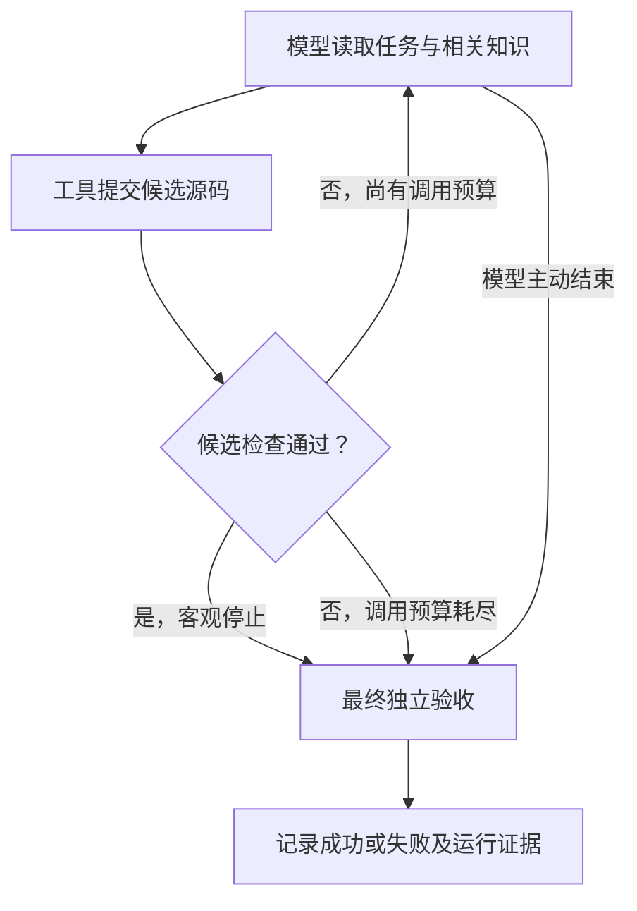

# 技术评委使用案例：从需求对话到节点、知识与运行证据

本文对应 `feat/roadmap-showcase-v1` 分支。以“编译失败修复员工”为例，解释如何装配一个项目，以及每项行为在代码中如何落地。

## 1. 先回答：描述工作流程后，确实会生成节点吗？

**会。具体机制是：AI 编程助手读取用户需求、仓库装配指引和公共 API，生成 Python 节点、业务回调与装配代码；底盘随后执行这些代码。**

这里需要区分两个阶段：

| 阶段 | 谁在工作 | 输入 | 产出 |
|---|---|---|---|
| 装配期 | AI 编程助手，例如 Claude Code | 用户对话、装配 Skill、现有代码、业务接口与规范 | 任务源、工具、验收器、流程节点、运行配置与启动脚本 |
| 运行期 | Chassis 与已经装配的模型适配器 | 一条实际任务、当前状态、相关知识 | 工具动作、候选修改、客观验收结果和运行记录 |

`FnStep("compile", ...)` 中的名称是标识，真正的编译行为来自回调函数。底盘没有内置“读到 compile 就会编译”的语义解释器，也没有把自然语言直接编译为工作流的通用编译器。

装配依据见[装配 Skill](../.claude/skills/assemble-digital-employee/SKILL.md)。它指导 AI 逐组确认任务来源、完成标准、流程、推理方式、知识、失败处理和模型接入。**生成是否正确，仍需代码检查和实际试跑。**

## 2. 一段完整的需求对话，如何变成装配决定？

下面是企业接入的示例对话；接口与业务回调需要按项目实现。

| 用户描述 | AI 助手需要确认或生成的内容 |
|---|---|
| “收到编译失败任务后，先取日志和源码，再判断失败类型。” | 明确构建系统接口和数据字段；生成 `TaskSource`，以及读取、解析材料的确定性函数。 |
| “先只处理 C++ 头文件引用位置错误。” | 限定任务范围，识别目标文件；把路径放入 `task.payload["target"]["path"]`，供知识路由使用。 |
| “让模型找正确引用位置，但别改变程序其他逻辑。” | 选用修复 `AgentStep`、ReAct 模式、模型适配器和提交候选的工具；把可检查的限制实现到验收器。 |
| “我有项目背景、C++ 规范，出错后也要告诉模型原因。” | 分别配置任务接入时的背景、执行前的规范、重试时的反馈，并落实谁读取这些内容。 |
| “必须实际编译通过，才交付补丁。” | 生成编译检查与失败分支；最终以 `DoneCriteria` 裁定，通过后才导出补丁。 |
| “以后可能增加 Python 质量修复。” | 复用底盘、协议适配与报告；增加相应任务源、修复工具和验收器，必要时增加路由分支。 |

接口地址、数据结构、编译命令或规范缺失时，AI 助手需要读取现有实现或补问。它不能仅靠节点名称推断公司内部系统的真实协议。

## 3. 节点做什么？节点逻辑从哪里产生？

### 3.1 把业务需求翻译成明确的输入、动作与输出

| 业务环节 | 对应构件 | 输入 → 处理 → 输出 | 逻辑来源 |
|---|---|---|---|
| 领取任务 | `TaskSource.fetch()`，在编排前运行 | 构建记录 → 提取本次任务 → `Task` | 用户提供的接口与字段，AI 生成或复用接入代码 |
| 准备材料 | `FnStep("prepare", prepare)` | 任务 → 读取源码和日志 → 工作区 / 任务材料 | 确定性的 API、文件和工作区操作 |
| 识别类型 | `FnStep("classify", classify)` | 日志与文件 → 已知规则匹配 → 类型与路由事实 | 业务规则生成的 Python 函数；若需模型判断，要显式装配模型节点 |
| 尝试修复 | `AgentStep("fix", pattern=..., toolbox=...)` | 任务、知识、工具观察 → 模型选动作 → 候选修改 | 推理模式控制循环，适配器构造请求，模型产生工具名和参数 |
| 检查候选 | `FnStep("compile_check", compile_check)`，或修复工具内部检查 | 当前候选 → 实际编译和差异检查 → 通过 / 失败事实 | 编译器输出与业务约束，不能只相信模型自述 |
| 最终验收 | `DoneCriteria.judge()`，由底盘统一调用 | 当前事实 / 产物 → 判据 → `Verdict` | 由用户明确的完成标准实现而来 |
| 导出交付物 | 成功分支中的确定性代码 | 成功结果 → 输出 patch 和报告 | 项目交付逻辑；参考 showcase 在 `run_once()` 返回后执行 |

**不是每一个业务环节都必须成为 `Step`，也不是每个节点都要请求模型。** 领取任务、最终验收和报告导出有各自的生命周期位置。

下面是四节点装配的结构示意。参数中的业务函数、模型 decider 和工具箱由项目提供；该代码本身不实现公司系统接入：

```python
from agent_chassis.orchestration import (
    AgentStep, FnStep, ReActPattern, StateMachineOrchestrator,
)

def make_flow(prepare, classify, decider, toolbox, compile_check):
    return StateMachineOrchestrator([
        FnStep("prepare", prepare),
        FnStep("classify", classify),
        AgentStep("fix", pattern=ReActPattern(decider, max_iterations=4),
                  toolbox=toolbox),
        FnStep("compile_check", compile_check),
    ])
```

其中 `prepare`、`classify`、`compile_check` 的签名为 `(task, ctx) -> None`，通过明确的状态与产物交接。`FnStep` 不会自动把函数返回值写入 `ctx.facts`；如果编译检查需要阻止继续执行，回调必须显式抛出异常，或在所选编排中实现对应分支。仅返回 `False` 不会让状态机自动停止。

最终完成标准通过 `.with_payload(source, criteria)` 配置。业务中间检查与最终验收应分清：`Chassis.judge()` 会缓存本次尝试的裁定，不应提前调用它后再修改候选。

### 3.2 “节点逻辑生成”有两种含义

| 类型 | 生成的是什么 | 发生时间 |
|---|---|---|
| 生成项目代码 | 普通函数、工具函数、`Step` 组合、条件路由、验收器 | 装配时，由 AI 编程助手编写，可审查和修改 |
| 生成下一步动作或计划 | ReAct 的工具调用；接入相应 planner 后，也可以产生工具计划或 `PlanNode` 依赖图 | 运行时，由配置的 decider / planner 产生 |

`PlanNode` 指向已经注册的工具及其参数、依赖，不等于运行时任意生成并执行新的 Python 函数。当前两个真实模型参考案例使用 **ReAct**，不能把它们当成其他推理模式均已完成真实模型验证的证据。

有条件分流时，AI 可以生成 `SubgraphOrchestrator` 的分析子图、路由函数和分支；分支逻辑仍是代码。当前 `LLMCompilerPattern` 按依赖分波执行，波内串行，不能描述成已实现并行 DAG 执行引擎。

源码：[节点与编排](../src/agent_chassis/orchestration/__init__.py) · [推理模式与 PlanNode](../src/agent_chassis/orchestration/reasoning.py)。

## 4. 知识应该在哪一步注入，底盘怎么知道？

**装配时，AI 根据知识用途提出配置；运行时，底盘根据显式事件和配置执行。** 需要分别确定“什么时候收集”“选哪份知识”“谁来消费”。

### 4.1 什么时候：把用途映射成注入点

| 用户提供的材料 | 可配置的注入点 | 实际触发位置与用途 |
|---|---|---|
| 项目背景、任务范围 | `TASK_ADMITTED` | Chassis 接纳任务后收集，提供本任务背景 |
| C++ 修改规范 | `BEFORE_EXECUTOR` | 在请求执行器前收集；当前直接 API 适配器在每次模型请求前触发 |
| 单次工具所需的操作说明 | `BEFORE_TOOL` | 普通工具经 `invoke_tool()` 调用前触发；工具若要使用，必须显式读取 |
| 上次尝试的失败原因 | `ON_RETRY` | Chassis 的重试策略允许重新尝试时触发；可由 `RetryFeedback` 提供 |
| 验收阶段需要的结构化参考数据 | `BEFORE_VERDICT` | 最终判据运行前收集；判据仍须自行读取并执行客观检查 |
| 所有任务共享的启动知识 | `AGENT_BOOT` | 当前默认留空，避免在启动层绑定具体业务规范 |

注意：把“必须编译通过”写进一段知识文本，不会自动产生编译检查。它必须同时落实成验收器的执行逻辑。

另外，**注入点是生命周期事件，不是节点名称**。`BEFORE_EXECUTOR` 默认覆盖相应的执行器调用，不会因某个节点叫 `fix` 就只对它生效。如果只允许某类任务或特定节点消费，应在 provider / 装配代码中依据任务或显式阶段状态筛选，并由消费者选择作用域；默认 `SkillProvider` 没有通用的节点名路由。

### 4.2 选哪份：通过任务元数据进行路由

下面这段配置可以直接构造知识提供者；运行时还需通过 `.with_knowledge(*providers)` 接入 Chassis：

```python
from agent_chassis import InjectionPoint as P
from agent_chassis.knowledge import (
    SkillLibrary, SkillProvider, StaticKnowledge, RetryFeedback, by_extension,
)

library = SkillLibrary(
    root="knowledge",
    rules=[by_extension({".cpp": "cpp-build", ".py": "python-quality"})],
    inline={
        "cpp-build": "使用已有头文件路径，只修改 include 行。",
        "python-quality": "与 None 比较使用 is，保持其他语法结构。",
    },
)
providers = [
    StaticKnowledge("本任务只处理指定文件。", points=[P.TASK_ADMITTED]),
    SkillProvider(library, points=[P.BEFORE_EXECUTOR]),
    RetryFeedback(),
]
```

若任务携带 `target.path = "probe.cpp"`，规则命中 `cpp-build`。`SkillLibrary` 优先读取 inline 内容，否则读取对应 Markdown 文件；未命中或文件不存在时不会凭空补出规范。当前内置路由是显式规则，不是向量检索或模型自动判断文档相关性。

这里有两个不同用途的 Skill：**装配 Skill**指导 AI 怎样编写项目；**运行期规范库**提供任务执行时的知识。两者不是同一条加载路径。

### 4.3 谁来消费：收集成功还不等于模型已经看到

当前直接 API 路径的实际调用链是：

1. `RuntimeDecider` 在模型请求前调用 `chassis.inject(BEFORE_EXECUTOR, task, ctx)`。
2. `InjectionScheduler` 筛选声明了该注入点的 provider，调用 `provide()`，把内容、来源、版本和哈希存入 `ctx.knowledge`，并记录注入事件。
3. 适配器调用 `ctx.context_for()`，按 **ON_RETRY → TASK_ADMITTED → BEFORE_EXECUTOR** 的顺序读取片段，并应用字符预算；放不下的完整片段会被省略并记录。
4. 返回的文本进入模型请求的 `context` 字段，与任务和本次尝试的工具观察一起发送。
5. `context_receipts` 记录实际读取的内容哈希、遗漏项及字符数；`model_calls` 另行记录请求结果和用量。

这条适配器路径**不会自动发送全部 `ctx.facts`**，也不消费所有注入点。比如把内容挂到 `BEFORE_TOOL`，不能据此认为它已经进了当前模型请求；需要对应工具或适配器明确读取并传递。

如果使用“工具内部调用外部 Coding Agent”的形式，则把工具名加入推理模式的 `executor_tools`，让 `invoke_tool()` 触发 `BEFORE_EXECUTOR`；工具通过 `add_contextual()` 接收运行上下文，再调用 `context_for()` 并把文本传给外部执行器。

**回执证明本地读取过什么，不证明模型理解了什么。** 字符预算也不是 token 计费预算。源码：[知识调度与路由](../src/agent_chassis/knowledge/__init__.py) · [上下文消费](../src/agent_chassis/contracts.py) · [模型请求构造](../adapters/runtime.py)。

## 5. 在当前真实案例中，一次任务究竟怎么跑？

当前 [showcase 装配](../tools/run_roadmap_showcase.py) 使用两个公开小任务。选择 `--flow state_machine` 时，实际只有一个 `AgentStep("work", ...)`；前面四节点案例是可装配的业务设计示意，不是该参考运行已经生成的节点清单。

以 C++ 场景为例：任务已经包含报错、源码和可用头文件清单。适配器读取相关规范，模型通过 `submit_source` 提交完整候选内容；该工具立即检查允许的修改范围并运行编译器。



图中展示正常控制路径，接口或工具异常另由失败策略处理。检查通过且候选摘要未变化时，`stop_when` 结束推理；最终仍由 `DoneCriteria` 验收。成功后输出 patch，失败时记录原因并按已注册清理动作收尾。

两种“再试一次”也要区分：工具返回不合格反馈后，ReAct 可以在同一尝试内继续请求模型；`ON_RETRY` 则对应 Chassis 重试机制启动的新尝试。当前参考装配没有把每次工具反馈都当成一次 `ON_RETRY`。

当前 C++ 判据只允许已知 include 行变化，再做真实编译检查；Python 判据检查期望 AST。它们能验证这些小任务，不能替代任意公司仓库的完整构建和测试。源码：[参考载荷与判据](../payloads/patch_showcase.py) · [运行生命周期与最终验收](../src/agent_chassis/chassis.py)。

## 6. 怎么确认“生成的项目”真的可用？

| 检查层次 | 评委可以查看什么 | 证明什么 |
|---|---|---|
| 装配结果 | 生成的节点与回调代码；`chassis.report()` 的组件、决策下放点、注入时间表 | 实际接了哪些元件；报告不等于所有业务逻辑已正确 |
| 输入与上下文 | 任务字段、模型请求 spy、知识消费回执 | 知识是否被正确选择并进入请求，而不只是打印了一条注入日志 |
| 行为与验收 | 工具反馈、失败分支、编译 / AST 结果、最终 `Verdict` | 是否真正满足完成标准；模型自述不能替代验收 |
| 可复核产物 | manifest、evidence、patch 及独立校验结果 | 装配、输入、用量、候选摘要与报告是否一致 |

`build()` 检查必要组件与判据接线，不是任意流程的形式化证明。装配 manifest 是描述性清单，当前不是一个能自动重建所有项目的可执行工作流文件。

相关回归入口：[上下文实际传递](../tests/test_context_delivery.py)、[模型请求适配](../tests/test_model_runtime.py)、[客观停止仍保留最终验收](../tests/test_objective_stop.py)、[实验报告核验](../tests/test_context_experiment.py)。

### 两条验证路径，各回答一个问题

- **“AI 能否根据对话搭建项目？”** 仓库已有 [Live Assembly 工作流](../.github/workflows/live-digital-employee-assembly.yml)：访谈后提供[业务答案](../tests/live_assembly/assembly_answers.md)，要求 AI 生成 `generated/live_ci_employee.py` 和装配清单，再执行检查。该验收场景明确允许事故分类采用确定性 decider 与 mock Connector，验证重点是装配过程；不能把它当成业务运行期调用模型的证据。本次编写文档没有重新触发该工作流。
- **“搭好的员工运行时是否真的调用模型？”** [Roadmap Showcase 的已验证运行](https://github.com/TIMPICKLE/devops-agent-chassis/actions/runs/33969106344)覆盖 Anthropic / OpenAI 兼容协议及上下文对照，共 10/10 次任务运行通过，每次一次模型调用；使用的是两个公开夹具，不是 10 个独立业务场景。完整结果见[第二阶段实测](../changelog/stage-02.md)。

## 7. 评委可直接复现的入口

在仓库根目录运行，C++ 场景需要系统有 `c++` 编译器。以下命令使用新输出目录：

```bash
python -m pip install -e ".[dev,llm]"

# 不调用模型：检查装配、工具、判据和报告链路
python tools/run_roadmap_showcase.py --mode offline --flow state_machine --output-dir reports/roadmap-showcase-review
python tools/verify_roadmap_evidence.py reports/roadmap-showcase-review

# 不调用模型：复现三种上下文策略及报告核验
python tools/run_context_experiment.py --mode offline --output-dir reports/roadmap-showcase-review-context
python tools/verify_context_experiment.py reports/roadmap-showcase-review-context
```

若已在环境中配置 `BIGMODEL_API_KEY`，可以显式使用真实模型路径：

```bash
python tools/run_roadmap_showcase.py --mode live --protocol openai --max-calls 4 --output-dir reports/roadmap-showcase-review-live
python tools/verify_roadmap_evidence.py reports/roadmap-showcase-review-live --require-live
```

真实路径缺少模型配置或请求失败会明确失败，不会切换成离线固定答案。参考脚本交付本地补丁和报告；企业系统接入、定时触发和正式代码交付仍需项目实现。

## 8. 可以怎样向评委表述项目价值？

“我们把自然语言需求经过 AI 辅助装配，落成可检查的节点、工具、知识配置和验收规则。运行时只在明确的节点请求模型，公共底盘负责流程与记录。新增业务主要补充业务接入和判据，再用实际结果衡量复用收益。”

当前实测中，不注入规范也能完成两个简单任务。因此可以说明**上下文路由和对照验证能力已实现**，但尚不能宣称知识注入普遍提高成功率。下一步应使用真正依赖企业规范的保留任务，衡量质量、调用量与迁移成本。

[返回 README](../README.md) · [领导版使用案例](LEADERS_USE_CASE.md) · [阶段变更概览](../changelog/README.md)
