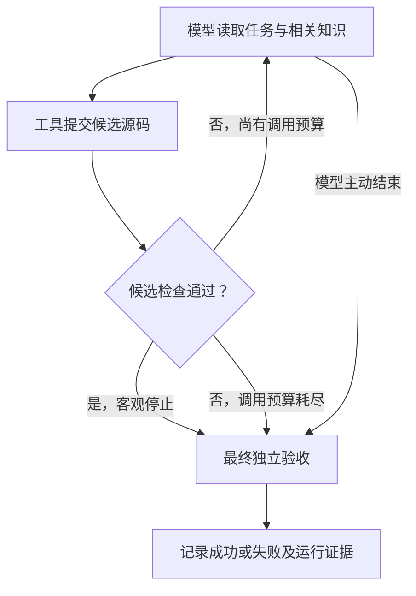

# 技术评委使用案例：从需求对话到节点、知识与运行证据

本文对应 `feat/roadmap-showcase-v1` 分支。以“编译失败修复员工”为例，解释如何装配一个项目，以及每项行为在代码中如何落地。

本文已同步第五阶段后的 T1–T5 维护，统一证据索引见[当前能力与验证](../roadmap/CURRENT_STATE.md)。第四阶段证明生成物实际运行；第五阶段证明知识更新后保留人工定制、改变同一输入的行为并通过旧任务回归。后续维护的合同测试与这些历史 live 结果分别记录，不扩大实测范围。

第三阶段新增了可直接运行的[四节点配置修复与多文档路由案例](CONFIG_POLICY_WORKFLOW.md)，附真实流程、冻结任务与知识对照实验入口。

第四阶段增加了[需求生成 → 项目运行 → 独立验收](GENERATED_EMPLOYEE_PROJECT.md)的 CLI 链路，实测见[阶段记录](../changelog/stage-04.md)。生成模型提交 `employee.py`、节点/知识清单和说明；随后在新进程加载生成代码，用运行期模型处理另外提供的源码目录。首版复用既有源码工具和编译判据，限定准备、模型修复、检查的线性节点组合。知识绑定由该员工类型的合同明确为 `before_executor`、`phase=repair`，模型必须遵守；这不是已经实现了任意知识注入时机的自动推断。下文的企业对话仍是更广泛的装配方式。

## 1. 先回答：描述工作流程后，确实会生成节点吗？

**会。当前已验证 CLI 由模型生成 `build_employee(kit)` 的 Python 节点接线、清单和说明，再由底盘执行；源码工具、模型适配器与编译判据复用已有实现。** 首版约定 3–8 个线性节点、一个模型节点，不能据此声称能自动生成任意业务回调。另有通用装配 Skill，可指导编程助手按项目编写更广泛的载荷，但需要逐项目验证。

这里需要区分两个阶段：

| 阶段 | 谁在工作 | 输入 | 产出 |
|---|---|---|---|
| 受限 CLI 装配期 | `assemble_employee.py` 调用真实模型 | 需求字段、知识内容、SDK 接线合同 | 员工接线代码、节点/知识清单、README；不重新编写共享工具与判据 |
| 通用辅助装配 | AI 编程助手，例如 Claude Code | 用户对话、装配 Skill、代码、业务接口与规范 | 按项目编写或复用载荷和装配；完成范围取决于实际实现与验证 |
| 运行期 | Chassis 与已经装配的模型适配器 | 一条实际任务、当前状态、相关知识 | 工具动作、候选修改、客观验收结果和运行记录 |

`FnStep("compile", ...)` 中的名称是标识，真正的编译行为来自回调函数。底盘没有内置“读到 compile 就会编译”的语义解释器，也没有把自然语言直接编译为工作流的通用编译器。

装配依据见[装配 Skill](../.claude/skills/assemble-digital-employee/SKILL.md)。它指导 AI 逐组确认任务来源、完成标准、流程、推理方式、知识、失败处理和模型接入。**生成是否正确，仍需代码检查和实际试跑。**

## 2. 一段完整的需求对话，如何变成装配决定？

下面是企业接入的示例对话；接口与业务回调需要按项目实现。

| 用户描述 | AI 助手需要确认或生成的内容 |
|---|---|
| “收到编译失败任务后，先取日志和源码，再判断失败类型。” | 明确构建系统接口和数据字段；生成 `TaskSource`，以及读取、解析材料的确定性函数。 |
| “先只处理 C++ 头文件引用位置错误。” | 限定任务范围，识别目标文件；把路径放入 `task.payload["target"]["path"]`，供知识路由使用。 |
| “让模型找正确引用位置，但别改变程序其他逻辑。” | 选用修复 `AgentStep`、ReAct 模式、模型适配器和提交候选的工具；把可检查的限制实现到验收器。 |
| “我有项目背景、C++ 规范，出错后也要告诉模型原因。” | 分别配置任务接入时的背景、执行前的规范、重试时的反馈，并落实谁读取这些内容。 |
| “必须实际编译通过，才交付补丁。” | 生成编译检查与失败分支；最终以 `DoneCriteria` 裁定，通过后才导出补丁。 |
| “以后可能增加 Python 质量修复。” | 复用底盘、协议适配与报告；增加相应任务源、修复工具和验收器，必要时增加路由分支。 |

接口地址、数据结构、编译命令或规范缺失时，AI 助手需要读取现有实现或补问。它不能仅靠节点名称推断公司内部系统的真实协议。

## 3. 节点做什么？节点逻辑从哪里产生？

### 3.1 把业务需求翻译成明确的输入、动作与输出

| 业务环节 | 对应构件 | 输入 → 处理 → 输出 | 逻辑来源 |
|---|---|---|---|
| 领取任务 | `TaskSource.fetch()`，在编排前运行 | 构建记录 → 提取本次任务 → `Task` | 用户提供的接口与字段，AI 生成或复用接入代码 |
| 准备材料 | `FnStep("prepare", prepare)` | 任务 → 读取源码和日志 → 工作区 / 任务材料 | 确定性的 API、文件和工作区操作 |
| 识别类型 | `FnStep("classify", classify)` | 日志与文件 → 已知规则匹配 → 类型与路由事实 | 业务规则生成的 Python 函数；若需模型判断，要显式装配模型节点 |
| 尝试修复 | `AgentStep("fix", pattern=..., toolbox=...)` | 任务、知识、工具观察 → 模型选动作 → 候选修改 | 推理模式控制循环，适配器构造请求，模型产生工具名和参数 |
| 检查候选 | `FnStep("compile_check", compile_check)`，或修复工具内部检查 | 当前候选 → 实际编译和差异检查 → 通过 / 失败事实 | 编译器输出与业务约束，不能只相信模型自述 |
| 最终验收 | `DoneCriteria.judge()`，由底盘统一调用 | 当前事实 / 产物 → 判据 → `Verdict` | 由用户明确的完成标准实现而来 |
| 导出交付物 | 成功分支中的确定性代码 | 成功结果 → 输出 patch 和报告 | 项目交付逻辑；参考 showcase 在 `run_once()` 返回后执行 |

**不是每一个业务环节都必须成为 `Step`，也不是每个节点都要请求模型。** 领取任务、最终验收和报告导出有各自的生命周期位置。

下面是四节点装配的结构示意。参数中的业务函数、模型 decider 和工具箱由项目提供；该代码本身不实现公司系统接入：

```python
from agent_chassis.orchestration import (
    AgentStep, FnStep, StateMachineOrchestrator,
)
from adapters.runtime import react_pattern

def make_flow(prepare, classify, config, decider, toolbox, compile_check):
    pattern = react_pattern(config, decider, toolbox=toolbox)
    return StateMachineOrchestrator([
        FnStep("prepare", prepare),
        FnStep("classify", classify),
        AgentStep("fix", pattern=pattern, toolbox=toolbox),
        FnStep("compile_check", compile_check),
    ])
```

其中 `prepare`、`classify`、`compile_check` 的签名为 `(task, ctx) -> None`，通过明确的状态与产物交接。`FnStep` 不会自动把函数返回值写入 `ctx.facts`；如果编译检查需要阻止继续执行，回调必须显式抛出异常，或在所选编排中实现对应分支。仅返回 `False` 不会让状态机自动停止。

`config` 与 decider 使用同一份 `ModelConfig`。T1 的统一入口会传入 `config.react_options()`，在首次请求前检查三项工具上限；
若手工构造 `ReActPattern`，需另行调用 `validate_react_alignment()`。普通自定义 decider 仍可直接使用核心类。
阶段名由编排器自动记录，回调无需重复 `ctx.record_step()`。

最终完成标准通过 `.with_payload(source, criteria)` 配置。业务中间检查与最终验收应分清：`Chassis.judge()` 会缓存本次尝试的裁定，不应提前调用它后再修改候选。

### 3.2 “节点逻辑生成”有两种含义

| 类型 | 生成的是什么 | 发生时间 |
|---|---|---|
| 生成项目代码 | 普通函数、工具函数、`Step` 组合、条件路由、验收器 | 装配时，由 AI 编程助手编写，可审查和修改 |
| 生成下一步动作或计划 | ReAct 的工具调用；接入相应 planner 后，也可以产生工具计划或 `PlanNode` 依赖图 | 运行时，由配置的 decider / planner 产生 |

`PlanNode` 指向已经注册的工具及其参数、依赖，不等于运行时任意生成并执行新的 Python 函数。当前已验证的主要模型运行路径使用 **ReAct**，不能把它们当成其他推理模式均已完成真实模型验证的证据。回调调用次数、`iterations` 和真实模型请求次数应分开；例如当前 PlanExecute 逐步调用工具，并不自动每步再调用模型，ReWOO 的 solver 也是可选的。

有条件分流时，AI 可以生成 `SubgraphOrchestrator` 的分析子图、路由函数和分支；分支逻辑仍是代码。当前 `LLMCompilerPattern` 按依赖分波执行，波内串行，不能描述成已实现并行 DAG 执行引擎。

ReAct 已增加[独立工具并行调用](PARALLEL_TOOLS.md)：装配代码声明 `parallel_safe=True` 并开启并发上限后，一轮可执行多个独立动作，收齐观察再决策。默认单调用；上下文工具、共享候选写入及有依赖动作仍须单独调用。这项能力不扩大其他推理模式的验证范围。

以生成员工的 scheduler 任务为例，模型可以在同一响应里提出两个 `read_file`，分别读取 `include/core/api.hpp` 和 `include/legacy/api.hpp`。底盘先预检整批，再并行读取；收齐观察后，模型在下一轮选择正确声明，通过单独的 `submit_source` 提交候选。`read_files(paths)` 则是一次工具调用，其内部读取不是多线程批次。生成阶段只有共享提交工具 `submit_project`，调高并发不会让生成过程自动并行。

| 参数 | 默认值 | 演示时如何解释 |
|---|---:|---|
| `--max-parallel-tools` | 1 | 同时执行的工具数；4 是可调示例值，不是硬编码最大值 |
| `--max-batch-calls` | 8 | 一轮最多提交的动作数；超过并发数的动作排队 |
| `--max-tool-calls` | 64 | 同一运行上下文的 ReAct 动作总预算，跨失败尝试保留；启动前整批预留 |

模型请求预算由 `--max-calls` 另行控制，一次响应包含多个工具动作仍只计一次模型请求。CLI 参数、工具声明和实际并发是三个不同层次；如何现场观察见[并行演示](#parallel-demo)。

源码：[节点与编排](../src/agent_chassis/orchestration/__init__.py) · [推理模式与 PlanNode](../src/agent_chassis/orchestration/reasoning.py)。

## 4. 知识应该在哪一步注入，底盘怎么知道？

**装配时，AI 根据知识用途提出配置；运行时，底盘根据显式事件和配置执行。** 需要分别确定“什么时候收集”“选哪份知识”“谁来消费”。

### 4.1 什么时候：把用途映射成注入点

| 用户提供的材料 | 可配置的注入点 | 实际触发位置与用途 |
|---|---|---|
| 项目背景、任务范围 | `TASK_ADMITTED` | Chassis 接纳任务后收集，提供本任务背景 |
| C++ 修改规范 | `BEFORE_EXECUTOR` | 在请求执行器前收集；当前直接 API 适配器在每次模型请求前触发 |
| 单次工具所需的操作说明 | `BEFORE_TOOL` | 普通工具经 `invoke_tool()` 调用前触发；工具若要使用，必须显式读取 |
| 上次尝试的失败原因 | `ON_RETRY` | Chassis 的重试策略允许重新尝试时触发；可由 `RetryFeedback` 提供 |
| 验收阶段需要的结构化参考数据 | `BEFORE_VERDICT` | 最终判据运行前收集；判据仍须自行读取并执行客观检查 |
| 所有任务共享的启动知识 | `AGENT_BOOT` | 当前默认留空，避免在启动层绑定具体业务规范 |

并行批次走 `_invoke_batch()`：协调线程先按请求顺序完成各动作的知识注入，再提交工作线程。工作线程不接收共享 `task/ctx`；不能把单调用工具显式读取上下文的写法直接当作并行工具配方。

注意：把“必须编译通过”写进一段知识文本，不会自动产生编译检查。它必须同时落实成验收器的执行逻辑。

另外，**注入点是生命周期事件，不是节点名称**。`BEFORE_EXECUTOR` 默认覆盖相应的执行器调用，不会因某个节点叫 `fix` 就只对它生效。如果只允许某类任务或特定节点消费，应在 provider / 装配代码中依据任务或显式阶段状态筛选，并由消费者选择作用域；默认 `SkillProvider` 没有通用的节点名路由。

### 4.2 选哪份：通过任务元数据进行路由

下面这段配置可以直接构造知识提供者；运行时还需通过 `.with_knowledge(*providers)` 接入 Chassis：

```python
from agent_chassis import InjectionPoint as P
from agent_chassis.knowledge import (
    SkillLibrary, SkillProvider, StaticKnowledge, RetryFeedback, by_extension,
)

library = SkillLibrary(
    root="knowledge",
    rules=[by_extension({".cpp": "cpp-build", ".py": "python-quality"})],
    inline={
        "cpp-build": "使用已有头文件路径，只修改 include 行。",
        "python-quality": "与 None 比较使用 is，保持其他语法结构。",
    },
)
providers = [
    StaticKnowledge("本任务只处理指定文件。", points=[P.TASK_ADMITTED]),
    SkillProvider(library, points=[P.BEFORE_EXECUTOR]),
    RetryFeedback(),
]
```

若任务携带 `target.path = "probe.cpp"`，规则命中 `cpp-build`。`SkillLibrary` 优先读取 inline 内容，否则读取对应 Markdown 文件；未命中或文件不存在时不会凭空补出规范。当前内置路由是显式规则，不是向量检索或模型自动判断文档相关性。

这里有两个不同用途的 Skill：**装配 Skill**指导 AI 怎样编写项目；**运行期规范库**提供任务执行时的知识。两者不是同一条加载路径。

### 4.3 谁来消费：收集成功还不等于模型已经看到

当前直接 API 路径的实际调用链是：

1. `RuntimeDecider` 在模型请求前调用 `chassis.inject(BEFORE_EXECUTOR, task, ctx)`。
2. `InjectionScheduler` 筛选声明了该注入点的 provider，调用 `provide()`，把内容、来源、版本和哈希存入 `ctx.knowledge`，并记录注入事件。
3. 适配器调用 `ctx.context_for()`，按 **ON_RETRY → TASK_ADMITTED → BEFORE_EXECUTOR** 的顺序读取片段，并应用字符预算；放不下的完整片段会被省略并记录。
4. 返回的文本进入模型请求的 `context` 字段，与任务和本次尝试的工具观察一起发送。
5. `context_receipts` 记录实际读取的内容哈希、遗漏项及字符数；`model_calls` 另行记录请求结果和用量。

这条适配器路径**不会自动发送全部 `ctx.facts`**，也不消费所有注入点。比如把内容挂到 `BEFORE_TOOL`，不能据此认为它已经进了当前模型请求；需要对应工具或适配器明确读取并传递。

如果使用“工具内部调用外部 Coding Agent”的形式，则把工具名加入推理模式的 `executor_tools`，让 `invoke_tool()` 触发 `BEFORE_EXECUTOR`；工具通过 `add_contextual()` 接收运行上下文，再调用 `context_for()` 并把文本传给外部执行器。

**回执证明本地读取过什么，不证明模型理解了什么。** 字符预算也不是 token 计费预算。源码：[知识调度与路由](../src/agent_chassis/knowledge/__init__.py) · [上下文消费](../src/agent_chassis/contracts.py) · [模型请求构造](../adapters/runtime.py)。

## 5. 早期 Showcase 中，一次任务怎么跑？

当前 [showcase 装配](../tools/run_roadmap_showcase.py) 使用两个公开小任务。选择 `--flow state_machine` 时，实际只有一个 `AgentStep("work", ...)`；前面四节点案例是可装配的业务设计示意，不是该参考运行已经生成的节点清单。

以 C++ 场景为例：任务已经包含报错、源码和可用头文件清单。适配器读取相关规范，模型通过 `submit_source` 提交完整候选内容；该工具立即检查允许的修改范围并运行编译器。



图中展示正常控制路径，接口或工具异常另由失败策略处理。检查通过且候选摘要未变化时，`stop_when` 结束推理；最终仍由 `DoneCriteria` 验收。成功后输出 patch，失败时记录原因并按已注册清理动作收尾。

两种“再试一次”也要区分：工具返回不合格反馈后，ReAct 可以在同一尝试内继续请求模型；`ON_RETRY` 则对应 Chassis 重试机制启动的新尝试。当前参考装配没有把每次工具反馈都当成一次 `ON_RETRY`。

当前 C++ 判据只允许已知 include 行变化，再做真实编译检查；Python 判据检查期望 AST。它们能验证这些小任务，不能替代任意公司仓库的完整构建和测试。源码：[参考载荷与判据](../payloads/patch_showcase.py) · [运行生命周期与最终验收](../src/agent_chassis/chassis.py)。

## 6. 怎么确认“生成的项目”真的可用？

| 检查层次 | 评委可以查看什么 | 证明什么 |
|---|---|---|
| 装配结果 | 生成的节点与回调代码；`chassis.report()` 的组件、决策下放点、注入时间表 | 实际接了哪些元件；报告不等于所有业务逻辑已正确 |
| 输入与上下文 | 任务字段、模型请求 spy、知识消费回执 | 知识是否被正确选择并进入请求，而不只是打印了一条注入日志 |
| 行为与验收 | 工具反馈、失败分支、编译 / AST 结果、最终 `Verdict` | 是否真正满足完成标准；模型自述不能替代验收 |
| 可复核产物 | manifest、evidence、patch 及独立校验结果 | 装配、输入、用量、候选摘要与报告是否一致 |

`build()` 检查必要组件与判据接线，不是任意流程的形式化证明。装配 manifest 是描述性清单，当前不是一个能自动重建所有项目的可执行工作流文件。

### T1–T5 在运行与报告中的对应关系

| 能力 | 当前如何使用/观察 | 边界 |
|---|---|---|
| T1 配置一致性 | Showcase、policy、员工生成/运行复用 `react_pattern` | 检查并发、批次、任务动作三项上限；手工接线需显式预检 |
| T2 工具诊断 | `diagnostics` / `model_calls[].diagnostic` 给出错误码及适用时的动作序号 | 整批预检失败零执行；不回显参数值或未知工具名 |
| T3 装配指导 | Skill 配方和 [example 07](../examples/07_verified_assembly.py) 联结装配、客观判据与报告 | 示例是 test-decider，不能当作 live 模型证据 |
| T4 执行与验收证据 | ReAct 自动记录 `execution.runs/batches`、峰值在途数及尝试编号；严格模式另需源码/装配绑定和 `record_check()` | 普通 CLI 未自动启用严格模式；名称叫 compile_check 不等于实际检查通过 |
| T5 HTTP 诊断 | `model_calls[].http_error` 记录 HTTP 类别、白名单代码、请求 ID 指纹 | 不输出正文、不自动重试；未知 usage 仍为 null |

生产格式检查使用 `verify_production_evidence.py`，检查完整性与内部一致性；
`verify_employee_project.py` 则重放本例的编译及差异验收，两者不能互相替代。
完整字段和接线见[并行与工具诊断](PARALLEL_TOOLS.md)、[生产格式证据](PRODUCTION_EVIDENCE.md)、[HTTP 诊断](HTTP_DIAGNOSTICS.md)。

### 现场遇到失败，怎样读报告？

下面是**合成情形的字段示意**，不是新增实机结果。字段从单次运行对象读取，例如 `runtime.evidence.json` 的 `runs[0]`；装配期失败可能尚未产生运行证据。

| 看到的结果 | 能得出的结论 | 下一步检查 |
|---|---|---|
| `diagnostics` 或 `model_calls[].diagnostic` 出现 `TOOL_NOT_PARALLEL_SAFE`，`action_index=2` | 第 2 个动作不符合批量调用约定，该批次预检失败，零工具执行；已发出的模型请求仍计入预算 | 根据工具的实际读写和依赖关系拆分动作，不能为了过检随意标记并行安全 |
| `execution.batches` 某批 `requested=2`、`started=2`、`succeeded=1`、`failed=1` | 两个动作已启动，其中一个失败；另一个可能已完成，不能认为整批已回滚 | 按 `batch_id`、`call_id` 查 `tool_calls`，确认结果和副作用后再决定重试 |
| `model_calls[].http_error` 为 `status=429`、`category=rate_limit` | 服务端返回 HTTP 429；若没有明确的白名单代码，仅凭状态不能区分限流与配额不足 | 核对服务端状态及可用的安全诊断字段；未知 usage 保持 null |

批次执行失败后，底盘等待已提交动作结束、完整记录结果，再进入已装配的失败策略。HTTP 诊断只补充信息，不新增自动重试；已有任务级重试策略独立生效。工具返回“候选不合格”是另一种情况：ReAct 可以在本次尝试剩余预算内继续修正，见第 5 节。

相关回归入口：[上下文实际传递](../tests/test_context_delivery.py)、[模型请求适配](../tests/test_model_runtime.py)、[客观停止仍保留最终验收](../tests/test_objective_stop.py)、[实验报告核验](../tests/test_context_experiment.py)。

### 四条验证路径，分别证明什么

| 路径 | 已验证内容 | 不能代替的结论 |
|---|---|---|
| [第四阶段生成项目](https://github.com/TIMPICKLE/devops-agent-chassis/actions/runs/34020348896) | 真实生成一次，同一员工在两个新进程处理不同源码输入，生成外的检查器重新编译 | 任意工作流/业务的自动生成能力 |
| [第五阶段项目更新](https://github.com/TIMPICKLE/devops-agent-chassis/actions/runs/34033606604) | 保留定制、更新知识；同一账单输入按 v1/v2 规范改变选择，两个旧任务回归通过 | 通用代码合并、生产成功率或任意知识的自动验收 |
| 早期 Live Assembly | 访谈后生成可检查的装配代码，允许确定性分类和 mock 接口 | 员工运行期实际调用模型 |
| 第二阶段 Showcase | 已编写装配中的真实模型适配与上下文对照 | 模型生成的员工代码能够启动 |

- **“AI 能否根据对话搭建项目？”** 仓库已有 [Live Assembly 工作流](../.github/workflows/live-digital-employee-assembly.yml)：访谈后提供[业务答案](../tests/live_assembly/assembly_answers.md)，要求 AI 生成 `generated/live_ci_employee.py` 和装配清单，再执行检查。该验收场景明确允许事故分类采用确定性 decider 与 mock Connector，验证重点是装配过程；不能把它当成业务运行期调用模型的证据。本次编写文档没有重新触发该工作流。
- **“搭好的员工运行时是否真的调用模型？”** [Roadmap Showcase 的已验证运行](https://github.com/TIMPICKLE/devops-agent-chassis/actions/runs/33969106344)覆盖 Anthropic / OpenAI 兼容协议及上下文对照，共 10/10 次任务运行通过，每次一次模型调用；使用的是两个公开夹具，不是 10 个独立业务场景。完整结果见[第二阶段实测](../changelog/stage-02.md)。

### 规范更新时，系统究竟改了什么？

`update_employee.py` 比较未修改基线、工作副本和新知识。只有既有知识文件的内容变化可自动更新；`request.json` 字段、流程清单变化或知识冲突会阻止应用。模型节点与检查节点的影响由显式合同确定，不是模型推测。预览和应用不调用模型，员工运行时仍调用模型。

代码和自定义文件从工作副本保留，新项目通过 `revision.json` 和 `.chassis/parent/` 追溯基线。保留人工修改不等于证明修改正确：生成合同只检查有限结构，还要重新运行新旧任务。来源 ID 是一致性记录，不是不可伪造的远程认证。

**编译通过不等于业务规范满足。** 通用 `verify_employee_project.py` 重新编译并检查修改范围与证据；第五阶段另由 `employee_update_demo.py` 检查头文件版本选择，两个版本都能编译才使该用例有区分度。企业新规范需要实现对应业务判据，知识文本不会自动变成验收代码。

## 7. 评委可直接复现的入口

在仓库根目录运行，C++ 场景需要系统有 `c++` 编译器。先安装依赖：

```bash
python -m pip install -e ".[dev,llm]"
```

下面各段按顺序执行；单条命令退出码非零时，先查看失败记录。所有输出目录应为新目录，重复演示请整体更换目录前缀。生成与任务运行会调用真实模型，需要在环境中配置 `BIGMODEL_API_KEY`；不要把 Key 写进文档或命令记录。预览、应用更新和独立核验不调用模型。

### 7.1 主线：生成一次，运行两个任务，再独立验收

```bash
# 生成时尚未提供后面的源码目录
python tools/assemble_employee.py --request-dir employee_requests/build_repair --output-dir reports/review-employee/project --max-calls 3 --max-tokens 16384 --timeout 240

# 两次运行复用同一项目；独立读取可并行，候选提交仍单独执行
python tools/run_generated_employee.py --project reports/review-employee/project --repo tests/employee_projects/pricing --unit src/main.cpp --output-dir reports/review-employee/pricing --max-calls 6 --max-tokens 4096 --timeout 120 --max-parallel-tools 4 --max-batch-calls 8 --max-tool-calls 64
python tools/run_generated_employee.py --project reports/review-employee/project --repo tests/employee_projects/scheduler --unit app/worker.cpp --output-dir reports/review-employee/scheduler --max-calls 6 --max-tokens 4096 --timeout 120 --max-parallel-tools 4 --max-batch-calls 8 --max-tool-calls 64

# 重放检查，不再次请求模型
python tools/verify_employee_project.py --project reports/review-employee/project --report reports/review-employee/pricing --report reports/review-employee/scheduler --require-live --summary-dir reports/review-employee
```

| 停下来展示什么 | 文件 | 成功条件与含义 |
|---|---|---|
| 员工如何工作 | `project/employee.py`、`project/assembly.json` | 生成命令成功；清单包含符合合同的 3–8 个线性节点 |
| 第一个任务交付什么 | `pricing/candidate.patch`、`pricing/acceptance.json` | `accepted=true`、`compiler_exit=0`；检查器确认原始失败及修改范围 |
| 是否复用了同一员工 | 两个任务的 `runtime.manifest.json` | `runtime.project_id` 相同；源码输入不同 |
| 两个任务是否都过关 | 根目录 `summary.json`、`summary.md` | `runtime_verified=true`、`distinct_inputs=2`；各任务验收通过 |
| 本次是否并行 | 各任务 `runtime.evidence.json` | 见下方批次检查；模型选择单调用也可能完成任务 |

表中路径均相对 `reports/review-employee/`。运行命令已核验原始目录未变；归档重放使用保存的快照，不重新检查已不存在的原始目录。成功条件针对本例的编译与修改范围，不等同于完整项目构建。

<a id="parallel-demo"></a>

### 7.2 并行：先稳定演示机制，再观察真实模型选择

```bash
python examples/07_verified_assembly.py
```

这个离线入口使用测试 decider 和同步屏障，输出应包含：

```text
PASS: configured=1, observed_parallel=False, independent verdict=succeeded
PASS: configured=2, observed_parallel=True, independent verdict=succeeded
Test decider only; production-format evidence is not live model validation.
```

它验证统一装配、实际工具重叠执行、独立判据和严格格式核验。示例只在内存中核验并打印结果，不创建报告目录。随后查看 7.1 中真实员工的保存报告：

```python
import json
from pathlib import Path

report = Path("reports/review-employee/scheduler/runtime.evidence.json")
run = json.loads(report.read_text(encoding="utf-8"))["runs"][0]
execution = run["execution"]
print("实际配置：", [item["limits"] for item in execution["runs"]])
print("发生过工具并发：", execution["parallel_observed"])
for batch in execution["batches"]:
    print({key: batch[key] for key in (
        "batch_id", "requested", "started", "succeeded", "failed", "peak_in_flight"
    )})
```

`peak_in_flight > 1` 证明底盘观察到多个工具调用同时执行；不证明 Connector 内部也并行，更不代表某个加速比。批次为空或 `parallel_observed=false` 时，应如实展示；模型可能只用了单调用或一次 `read_files`。这些普通员工报告含自动遥测，但没有自动接入 example 07 的严格来源绑定与检查回执。

### 7.3 维护：保留定制，更新知识，再验新旧任务

这一段使用单独目录和明确的账单 v1/v2 规范，以便证明行为随知识改变。它会新生成一个基线员工，不修改 7.1 的项目；具体材料与命令对应[更新工作流](../.github/workflows/employee-update.yml)。

```bash
python tools/employee_update_demo.py prepare-requests --output-dir reports/review-update
python tools/assemble_employee.py --request-dir reports/review-update/requests/v1 --output-dir reports/review-update/base --max-calls 3 --max-tokens 16384 --timeout 240
python tools/employee_update_demo.py prepare-working --output-dir reports/review-update

# 先预览 plan.md / plan.json；现场确认影响清单后再执行下一条应用命令
python tools/update_employee.py --project reports/review-update/base --working-copy reports/review-update/working --request-dir reports/review-update/requests/v2 --plan reports/review-update/plan.json --require-live
python tools/update_employee.py --project reports/review-update/base --working-copy reports/review-update/working --request-dir reports/review-update/requests/v2 --plan reports/review-update/plan.json --apply --output-dir reports/review-update/updated --require-live

# 同一账单输入比较新旧规范，再用新员工重跑两个旧任务
python tools/run_generated_employee.py --project reports/review-update/base --repo tests/employee_projects/billing --unit app/billing.cpp --output-dir reports/review-update/old-billing --max-calls 6 --max-tokens 4096 --timeout 120
python tools/run_generated_employee.py --project reports/review-update/updated --repo tests/employee_projects/billing --unit app/billing.cpp --output-dir reports/review-update/new-billing --max-calls 6 --max-tokens 4096 --timeout 120
python tools/run_generated_employee.py --project reports/review-update/updated --repo tests/employee_projects/pricing --unit src/main.cpp --output-dir reports/review-update/regression-pricing --max-calls 6 --max-tokens 4096 --timeout 120
python tools/run_generated_employee.py --project reports/review-update/updated --repo tests/employee_projects/scheduler --unit app/worker.cpp --output-dir reports/review-update/regression-scheduler --max-calls 6 --max-tokens 4096 --timeout 120
python tools/employee_update_demo.py verify --output-dir reports/review-update
```

| 停下来展示什么 | 相对 `reports/review-update/` 的产物 | 成功条件与含义 |
|---|---|---|
| 规范变化会影响哪里 | `plan.md`、`plan.json` | 查看知识变化、受影响节点、保留的人工修改和冲突；存在冲突时不应用 |
| 人工定制是否保留 | `working/` 与 `updated/` 的 `employee.py`、`TEAM_RUNBOOK.md`；`updated/revision.json` | 新版本保留工作副本中的代码和说明，记录基线来源 |
| 同一任务是否遵循新规范 | `old-billing/candidate.patch`、`new-billing/candidate.patch` | 旧版引用 v1，新版引用 v2；外部业务检查器验证实际选择 |
| 更新是否完成且旧任务仍通过 | `summary.json`、`summary.md` | `accepted=true`、`behavior_changed_on_same_input=true`、`old_tasks_passed=2`、`update_model_calls=0` |

`update_model_calls=0` 只指更新操作；基线生成及四次任务运行仍请求模型。两种账单头文件都能编译，所以版本选择必须由专门的业务检查验证。用法和限制见[生成/运行说明](GENERATED_EMPLOYEE_PROJECT.md)、[更新说明](EMPLOYEE_PROJECT_UPDATES.md)。

### 7.4 可选：早期 Showcase 与上下文实验

以下入口用于解释底层机制，不等同于上述生成项目链路。

```bash
# 不调用模型：检查装配、工具、判据和报告链路
python tools/run_roadmap_showcase.py --mode offline --flow state_machine --output-dir reports/roadmap-showcase-review
python tools/verify_roadmap_evidence.py reports/roadmap-showcase-review

# 不调用模型：复现三种上下文策略及报告核验
python tools/run_context_experiment.py --mode offline --output-dir reports/roadmap-showcase-review-context
python tools/verify_context_experiment.py reports/roadmap-showcase-review-context
```

若已在环境中配置 `BIGMODEL_API_KEY`，可以显式使用真实模型路径：

```bash
python tools/run_roadmap_showcase.py --mode live --protocol openai --max-calls 4 --output-dir reports/roadmap-showcase-review-live
python tools/verify_roadmap_evidence.py reports/roadmap-showcase-review-live --require-live
```

真实路径缺少模型配置或请求失败会明确失败，不会切换成离线固定答案。参考脚本交付本地补丁和报告；企业系统接入、定时触发和正式代码交付仍需项目实现。

## 8. 可以怎样向评委表述项目价值？

“我们已把受限需求生成、实际任务运行和独立验收串起来；规范变化后，可以保留团队定制、更新知识，再检验行为变化和原有能力。底盘提供公共机制，新增业务仍需接入自己的工具与验收标准。”

第二阶段不注入规范也能完成两个简单任务；第三阶段有按知识路由成功的案例，也保留了无知识组执行异常；第五阶段验证了同一输入的新旧规范选择。它们证明各自受限能力，仍不能外推普遍成功率或成本优势。下一步重点是实际构建配置、企业任务与公平比较。

[返回 README](../README.md) · [领导版使用案例](LEADERS_USE_CASE.md) · [阶段变更概览](../changelog/README.md)
