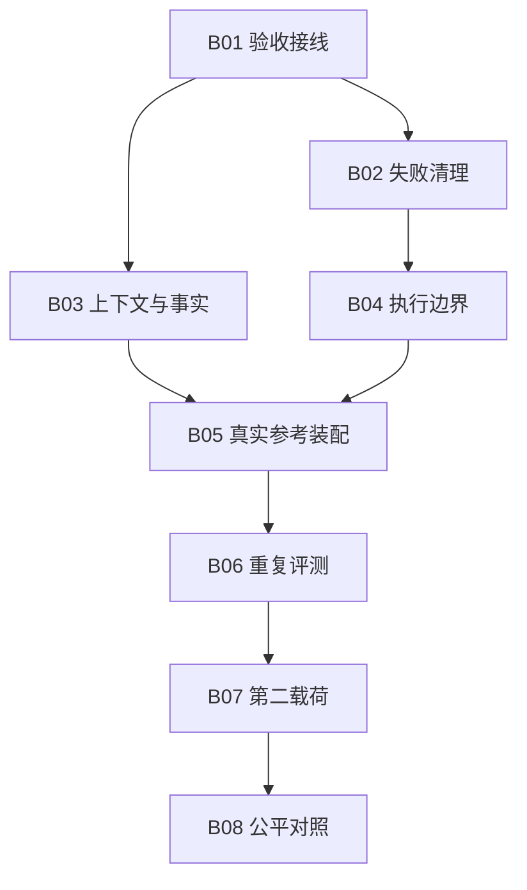

# Execution Backlog · 修订版 v2

> 更新：2026-09-05；基线：`bdd2b0a`。
> 已进入 `feat/roadmap-showcase-v1` 分支实施。以下保留任务的完整验收门槛；实际完成度见 [IMPLEMENTATION.md](./IMPLEMENTATION.md)。用户已要求本轮优先前瞻性与可拓展性，新安全平台建设延后，不撤销已有约束。

## 1. 任务与优先级

- **P0：** 现有契约正确性和安全接线，必须在相应真实动作前完成。
- **P1：** 参赛证据、参考接入与复用验证。
- **C 系列：** 后续有条件选项，不计入比赛必做范围。
- 里程碑沿用主文档 M0–M3；B 编号在四份文档中含义一致。

| ID | 任务 | 优先级 | 依赖 | 初估人日 | 主要产物 |
|---|---|---|---|---:|---|
| B01 | 单一权威验收接线与能力声明校准 | P0 | 无 | 2–3 | 缺失/冲突/不执行验收的回归测试 |
| B02 | 判据失败清理与单次终态处理 | P0 | B01 的终态约定 | 1–2 | 否决后清理、不重试、单次记账 |
| B03 | 知识真实传递与判据输入边界 | P0 | B01 | 2–3 | 上下文接收断言、受信事实输入 |
| B04 | 按接入路径约束执行与交付 | P0 | B01/B02；并行设计 B03 | 3–5 | 工具/进程限制、固定验证器、无外部写入 |
| B05 | 一个真实 AI 场景参考装配 | P1 | B01–B04 | 3–6 | 边缘 adapter、patch、独立验收 |
| B06 | 有限评测与可复核运行证据 | P1 | 设计从 M0 开始；live 部分依赖 B05 | 2–4 | 冻结案例、重复结果、成本/错误分布 |
| B07 | 第二载荷与最小配置记录 | P1 | B05/B06 | 2–4 | 复用工时、变更记录、配置清单 |
| B08 | 公平对照、价值核算与参赛证据 | P1 | B06/B07 | 3–5 | 方案对照表、净收益、限制与演示 |
| 合计 | B01–B08 | — | — | **18–32** | 不是企业平台交付范围 |

估算假设：一位熟悉仓库的工程师、一个操作系统、已有合规可用的模型/执行器、可脱敏的小型案例、测试环境可用。约 25% 缓冲后是 23–40 个工作日；接入审批、生产发布、跨平台沙箱、额外 Harness 的大规模集成均不在估算内。

先做 B01/B02 和一次接入 spike，再重估。任务改动超过范围时应拆分或删减，不以“最小版”掩盖工作量。

## 2. 依赖关系

B06 的案例与指标设计在 M0 即开始；不能等全部实现结束才设计测试。B04 也不依赖某个核心 ModelProvider 类存在。

## 3. B01 — 单一权威验收接线与能力声明校准

问题：见审计 F01。Chassis 的 criteria 和编排器的 criteria 是两个入口，装配报告中的判据未必被执行。

建议：

- 先确定验收责任归属：由 Chassis 统一最终验收，或通过明确协议接线并验证实际裁定；不要在多处重复判卷。
- 对旧版内置编排器、自定义编排器和单独使用编排器写兼容测试。
- 若两个入口提供不同判据，在 build 阶段报错或要求显式选择，不静默覆盖。
- 已结束任务的 verdict、error、outcome 保持一致。
- 更新能力说明中的旧 MCP 状态、推理模式真实语义与装配引用路径；本次不新建完整配置 DSL。
- 无证据的生产数字标记为作者声明/待核验，不删除作者事实陈述，也不替其背书。

验收：

- [x] 只调用 with_payload 的拒绝判据会被执行，任务不能成功。
- [x] 只配置一次判据即可正确工作；冲突能明确报错。
- [x] 缺 verdict 的自定义编排器不能造成静默误放行。
- [x] 判据不会因接线修复意外重复运行。
- [x] 装配报告与实际采用的判据一致。
- [x] 既有用例保持预期语义；需要兼容迁移的变化有说明。

不做：重写所有编排器为持久化工作流、强制新增 ModelProvider。

## 4. B02 — 判据失败清理与单次终态处理

问题：见 F02。返回 FAILED 与抛异常的清理行为不同。

建议：

- 把“失败后清理”“是否允许重试”“终态记账”拆成明确责任。
- 判据否决走终态清理，不重新执行整条业务链。
- 保留原始否决原因；补偿失败追加单独记录。
- cleanup 仅处理本任务创建的分支/文件/资源，有幂等要求。
- 人工拒绝、超时、取消的资源归属另定策略；不要把“等待”都当失败销毁。

验收：

- [x] 修改状态后 verdict=False，cleanup 执行一次且残留可检查。
- [x] 否决后尝试次数仍为一次，终态仅记账一次。
- [x] cleanup 失败仍可看到原始 verdict 与补偿失败。
- [x] 异常重试的既有行为不回退。
- [x] 测试资源中预先存在的用户文件/改动保持不变。

不做：声称任何通知、外部工单或发布都可以完全撤销。

## 5. B03 — 知识真实传递与判据输入边界

问题：F03/F05。注入文本在默认路径被丢弃，完整可变 ctx 又同时暴露事实与模型说明。

最小设计：

- 为本轮上下文定义明确的消费接口，包含文本、来源、版本、作用域与接收者。
- 执行器 adapter 接收 BEFORE_EXECUTOR 内容；API adapter 在下一次模型请求中接收对应内容。
- 先用 spy/fake consumer 精确断言内容和时机，再以小规模 A/B 检查行为；Trace hash 单独不能证明已经传递。
- 重试反馈只传给当前任务/尝试，不泄露到其他任务。
- 判据不读取 model_notes；采用只读视图或明确参数缩小误用面。
- 受信事实由验证器采集，标记来源；外部工具返回的自然语言仍是待验证数据。
- 验收规则在开始执行前固定，BEFORE_VERDICT 不能由模型临时改成功门槛。

验收：

- [x] executor/API 请求中确实包含应注入内容（spy 断言；远端效果另验）。
- [ ] 默认 AGENT_BOOT 无技术栈知识；不相关工具不收到该 Skill。
- [ ] 两任务并行/连续运行时上下文不串。
- [x] 修改 model_notes 不改变参考场景 verdict。
- [ ] 缺少必要事实/采集失败时不自动成功。
- [ ] 默认记录来源/哈希，不把 Secret 或完整敏感正文落入日志。

不做：RAG 平台、向量数据库、远端 Skill 市场。

## 6. B04 — 按接入路径约束执行与交付

目标：先支持 B05 选中的路径，不同时重造所有执行模式。

### 路径 A：借用 Coding Agent（有可用执行器时优先评估）

- 用其受支持的权限、Hooks、沙箱/SDK 控制接口；核实具体版本可控制哪些子进程和网络行为。
- 只传必要输入与允许路径，不向执行器提供 push/merge/通知凭据。
- worktree 管工作区分离，进程/文件系统/网络隔离另有受测配置。
- 可信控制代码与固定测试基线不在执行器可写范围内。
- 不能截获全部内部工具活动时，如实标记为执行器级观测；不伪造完整细粒度 Trace。

### 路径 B：直接模型 API

- adapter 生成/验证明确的工具参数 Schema，未知工具、非法参数先拒绝再执行。
- 每个暴露工具绑定 capability、作用域、超时和副作用分类。
- 工具名用精确映射；外部注解不能代替本地授权。
- 统一入口约束受管理的工具调用；不把同进程 Python 当作不可信代码隔离机制。
- 完整 Schema 验证可放在可选 adapter，不为此强迫零依赖核心手写 JSON Schema 引擎。

### 两条路径共同要求

- 先限定为“读输入、改隔离副本、输出 patch”，默认无外部写操作。
- 若需对外交付，先质量门禁，再针对动作/资源/参数的授权，最后交付与外部状态确认。
- 超时或终止要说明是否真的停止了子进程；线程超时不代表任意 Python 函数已停止。
- 有写入且结果不明时先查询/对账，不自动重试。
- 记录被拒绝的尝试、实际动作和原因摘要，不要求保存模型隐藏思维过程。

验收：

- [ ] 明确一页威胁模型：信任哪些插件、执行器、系统和网络。
- [ ] 外部恶意文本要求越权时，受测执行边界阻断实际动作。
- [ ] 执行器不能修改可信验证规则或读取宿主交付凭据。
- [ ] 未授权网络/路径访问由实际执行限制拒绝，不只由 Prompt 拒绝。
- [ ] patch 未通过门禁不会执行真实交付。
- [ ] 如果授权/安全审计不可用，阻止对应高风险动作；普通遥测另有降级策略。

不做：宣称防住任意宿主恶意代码、所有沙箱逃逸或全部 Prompt Injection。

## 7. B05 — 一个真实 AI 场景参考装配

范围：选择一个代码质量/构建问题，输入固定，修复方法不硬编码；最终只产出 patch 和证据。

实施：

1. 复用现有 TaskSource、外层步骤和框架公共 API。
2. 在装配边缘选择外部 Coding Agent 或一个真实 LLM API，不把厂商 SDK 放进通用核心。
3. 如已有公司 Gateway，优先复用；配置只存凭据引用。
4. 验证模型/执行器确实被调用，记录可获得的版本、请求/会话标识、用量与限制。
5. 独立运行原有测试及针对目标问题的断言，不能只查 diff。
6. 保留 offline Demo 和 fake adapter；没有合规凭据则 live 状态明确为未验证。
7. ReAct/计划式执行若触发步数/时间上限，报告 budget stop，最终结果仍由判据决定；不得把上限触发叫作成功收敛。

验收：

- [ ] 从真实 AI 输入到 patch，再到外部验证，能一条命令复现。
- [x] 没有把规则分类或固定补丁伪装成 AI 决策。
- [ ] Provider 配置存在之外，还存在运行期调用证据。
- [ ] 不通过测试、无修改、无效输出、超预算都有可解释结果。
- [ ] 秘密值不进入代码/配置/报告。
- [ ] 整个参考场景没有未经批准的外部写入。

不做：首版强制两种 Provider、所有 ReasoningPattern live 化或真实 DAG 并发。

## 8. B06 — 有限评测与可复核证据

范围：先使用现有 RecordingObserver 和 JSON/Markdown 报告，避免先做观测平台。

实施：

- 从 M0 开始定义开发案例、独立保留案例、失败模式和动作禁区。
- 正确性测试确定性执行；live 测试另跑，不让普通 PR 必须消耗付费额度。
- 建议首批冻结 20 个不同案例 × 每方案 3 次；不足则披露样本限制，不通过删除失败样本美化数据。
- 轨迹检查以必要证据、禁止动作和依赖关系为主；不要求模型走唯一固定工具序列。
- 同案例多次采样有相关性；按案例分组报告，不能当成全部独立新任务。
- 记录代码 SHA、任务/验证器版本、执行器/模型版本、Skill、允许能力、预算、结果、用量和制品 hash。
- 报告错误放行率、验收率、人工复核/返工时间、实际违规动作、成本和耗时。
- 内置 canary 检查脱敏，日志保留期由组织数据政策决定。

验收：

- [ ] 开发集与最终测试集分开，版本和排除规则预先固定。
- [x] 已知 F01/F02 及“错误变更后失败”进入确定性回归。
- [ ] 外部 Prompt Injection、伪造成功、规则篡改、输出超时覆盖受测边界。
- [ ] 冻结关键回归集发现一次错误放行/违规执行即阻断候选发布。
- [ ] 未观测到违规时写“0/n 次”，不写“风险为零”。
- [ ] 费用缺失、样本小、Provider 不可用均在报告中可见。
- [x] 参考运行报告链接到执行证据，哈希不被描述成防篡改认证。

不做：所有攻击类型已覆盖、用少量样本证明 100% 可靠。

## 9. B07 — 第二载荷与最小配置记录

范围：任务来源或完成判据必须实质不同，建议从质量修复切换到构建失败定位；最终以数据可用性为准。

实施：

- 核心稳定后计时开始接入第二载荷，记录准备、编写、调试和验证工时。
- 记录复用代码、专属代码和必要的核心修改；不以代码行数作为唯一效率指标。
- 生成最小装配/运行清单：任务来源、判据、执行器、允许工具、Skill、预算、版本与证据。
- 保留 Python 装配脚本作为任意合法流程的表达方式。
- 只有配置需要被外部系统消费时才进一步定义 Schema；不强制先把流程转换为 YAML DSL。

验收：

- [ ] 第二载荷通过同一组适用的控制/失败合同测试。
- [ ] 接入成本包含调试和修复，不只统计生成文件时间。
- [ ] 核心改动、复制胶水代码和不能复用部分如实记录。
- [ ] 配置/报告没有 Secret 值。
- [ ] 更换载荷后观察数据仍可比较，不为场景另造核心表结构。

不做：把“绝对零核心改动”当不可打破的宣传指标。

## 10. B08 — 公平对照与参赛证据

必做基线：

- A：Claude Code 或已选执行器，合理配置其原生能力。
- B：同一执行器 + 小型脚本 + Hooks + CI，允许使用外部测试与清理。
- D：本底盘 + 同一执行器。

扩展基线：

- C：DeepSeek Harness + 等价业务集成。先核对固定版本和模型支持；只有能控制条件时才进行性能/效果比较。无法公平对齐时只给架构比较，不编造分数。

比较：

- 固定任务集、初始代码、验证器、权限、信息、预算与重试条件。
- 对比接入工时、采纳率、错误放行、人工复核、成本与恢复限制。
- 接入成本单独计时，运行性能单独统计；不拿别人完整开发工时与自己的增量配置时间比较。
- 如果模型或工具不同，把差异标成混杂因素，不能把效果差异全归因于底盘。
- 实测不优于简单脚本时，收缩定位到真正有价值的场景，不增加组件掩盖结果。
- 评委材料引用版本化证据；业务统计按时间窗、分母、去重和版本对应关系展示。

验收：

- [ ] 完成 A/B/D 的同条件对照；条件不足时将 B08 标为未完成，不能用架构比较代替实测。
- [ ] 对照方案允许使用原生安全能力，不人为削弱基线。
- [ ] 明确“已有能力”“待验证优势”“不适用场景”。
- [ ] 提供失败例子、限制与净收益，不只给成功截图。
- [ ] 演示只包含已实现并验证的步骤；网络回放清楚标注。

不做：声称 Claude Code 没有权限控制、DeepSeek Harness 不能扩展，或用标准名词证明竞争优势。

## 11. C 系列：后续有条件选项

| ID | 方向与启动条件 | 最小范围 | 验收边界 |
|---|---|---|---|
| C01 | 长任务、跨进程等待审批或恢复确有需求 | Task 状态、SQLite 步骤记录、租约/取消、pending approval | 按故障窗口测试；未知外部写入转对账，不承诺 exactly-once |
| C02 | 企业已有 OTel 平台和日志政策 | 可选 exporter，模型/工具/门禁跨度，默认脱敏 | 固定语义版本；不能采集所有 Prompt 作为默认行为 |
| C03 | 目标 MCP Server 使用新能力 | SDK 覆盖检查后补所需 Auth/Tasks/resources/elicitation | 报告能力子集、SDK 版本与互操作测试，不叫全协议认证 |
| C04 | Trace 证明独立工具串行是主要瓶颈 | 有界并发、资源冲突、上下文隔离、取消 | 独立调用确有耗时收益；副作用不安全时保持串行 |
| C05 | 出现明确 A2A 对接团队与任务 | 适配 Agent Card/Task/Artifact；身份和预算传递 | 有实际 peer 的互操作测试；认证不等于授权 |
| C06 | 多消费者需要部署和版本治理 | 配置 Schema、插件入口、兼容性包 | 不破坏现有 Python 装配；迁移至少覆盖受支持版本 |
| C07 | 多团队试点出现隔离与容量需求 | 外置存储、worker、租户/配额/retention | 压测和隔离测试先行，不默认重造完整平台 |
| C08 | 正式发行或组织供应链要求 | Actions/依赖固定、扫描、SBOM、provenance | 验证制品来源；不是 Agent 行为安全认证 |
| C09 | ACS 有明确采用方和稳定目标版本 | 可选 policy hook/telemetry adapter | 项目级兼容测试；不宣称获得不存在的认证 |

C 系列没有承诺日期或总包工期。启动前写一页 ADR：需求、替代方案、实现边界、成本、退出条件。

恢复特别约定：

| 故障窗口 | 可采取的策略 |
|---|---|
| 外部动作尚未发出 | 按记录恢复，可安全重新准备 |
| 下游支持幂等键，响应丢失 | 复用同一业务键，核实下游时效与参数绑定 |
| 外部动作可能成功，不支持幂等但可查询 | 先查询对账，匹配后记录结果 |
| 无法幂等且无法确认结果 | 停止自动重试，等待人工确认 |
| 补偿失败 | 保留原始错误与残留清单，转人工处理 |

## 12. 推荐小 PR 顺序

这是建议拆分边界；当前先以新分支上的分步提交实现，未经另行确认不合并主分支。安全平台扩展按用户要求延后，不能因此将 B04 的完整安全验收记为完成。

1. B01：验收责任与接线回归，附行为变更说明。
2. B02：否决清理，不改变既有不重试语义。
3. B03：上下文传递与消费断言；判据输入收紧可再拆一个 PR。
4. B04：先落一条执行路径的权限/沙箱/门禁，再做安全用例。
5. B05：一个真实参考装配，不顺手实现其他模型。
6. B06：把离线回归和付费 live suite 分开，附有限统计。
7. B07：第二载荷与实际接入记录。
8. B08：公平对照报告和演示材料。

每个 PR 必须列出影响范围、失败路径、测试、数据/副作用风险。按语义边界拆分，不用固定行数代替可审查性。

## 13. Definition of Done

- [ ] 代码、说明和实际行为一致。
- [ ] 成功路径、失败路径、权限拒绝与必要清理均有测试。
- [ ] Demo、live smoke、重复评测与生产数据明确分层。
- [ ] 新增依赖/协议只放适当的集成边缘，保持基础使用轻量。
- [ ] 没有敏感数据泄露或未经授权的外部动作。
- [ ] 兼容性影响、未覆盖场景、无法取消/补偿的行为明确披露。
- [ ] 运行报告说明具体版本与验证范围，不能仅写“全部通过”。

核心修复完成不代表全部规划完成；C 系列长期选项不作为 M0–M3 的隐含阻塞项。
